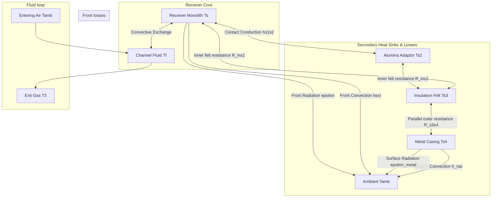

@0# Theory Manual: 5-Node Lumped Parameter Solar Receiver Model (v2)

This document provides a comprehensive, technically rigorous description of the mathematical formulation, geometric parameters, boundary conditions, and evaluation metrics of the updated 0D lumped parameter model (`0D_v2.jl`). This documentation is formatted to be suitable for direct inclusion in a scientific thesis or academic journal manuscript.

---

## 1. Physical System Description

The solar receiver setup consists of a high-temperature Silicon Carbide (SiC) honeycomb monolith receiver mounted in a solar simulator cavity. The system features:
1.  **SiC Honeycomb Monolith (Receiver Core):** A square monolith of side $w_t = 20\text{ mm}$ containing a $10 \times 10$ channel array. Solar flux is incident on its frontal face, while air flows axially through the channels to absorb heat.
2.  **Alumina Adaptor:** An alumina silicate sleeve connecting the rear of the monolith to the exit gas quartz tube. It overlaps the receiver solid to guide fluid and acts as a secondary heat sink.
3.  **Insulation Felt:** An alumina silicate felt layer surrounding the receiver and adaptor radially to prevent heat loss.
4.  **Metal Casing:** An aluminum protective outer shell enclosing the insulation felt. It loses heat to the ambient laboratory environment via natural convection and radiation.

In the updated model version (`v2`), the physical thermal masses of all these domains are modeled as separate lumped temperature nodes to capture their transient heat storage capacities, resolving significant thermal inertia discrepancies present in previous model versions.

---

## 2. Mathematical Formulation (ODE Governing Equations)

The transient thermal response of the system is modeled by a set of five coupled, non-linear Ordinary Differential Equations (ODEs), representing a 5-node lumped capacitance thermal network:

### 2.1 Node 1: Monolith Receiver ($T_s$)
$$\rho_s V_s C_{p,s}(T_s) \frac{dT_s}{dt} = \alpha I_0 A_{frt} - Q_{ext,conv} - Q_{ext,rad} - Q_{fluid} - Q_{s1s2} - Q_{s1s3}$$

Where:
*   $\alpha I_0 A_{frt}$ is the solar power captured on the frontal face.
*   $Q_{ext,conv} = h_{ext} A_{frt} (T_s - T_{amb})$ is the convective loss from the front face to the ambient.
*   $Q_{ext,rad} = \epsilon \sigma A_{frt} (T_s^4 - T_{amb}^4)$ is the radiative loss from the front face.
*   $Q_{fluid} = h_{avg,f}(T_f) A_{exchange} (T_s - T_f)$ is the heat transferred to the air stream.
*   $Q_{s1s2} = h_{s1s2} A_{s1s2} (T_s - T_{s2})$ is the contact conduction heat loss to the alumina adaptor.
*   $Q_{s1s3} = \frac{T_s - T_{s3}}{R_{ins1}}$ is the radial conduction loss to the insulation felt.

### 2.2 Node 2: Channel Fluid ($T_f$)
$$\rho_f(T_f) V_f C_{p,f}(T_f) \frac{dT_f}{dt} = \dot{m} C_{p,f}(T_f) (T_{amb} - T_f) + h_{avg,f}(T_f) A_{exchange} (T_s - T_f)$$

Where:
*   $\dot{m} = \rho_f(T_{amb}) \cdot \dot{V}_{lpm}$ is the mass flow rate (kg/s).
*   The first term represents advective heat removal, assuming entering air is at ambient temperature ($T_{amb}$).

### 2.3 Node 3: Alumina Adaptor ($T_{s2}$)
$$\rho_{s2} V_{s2} C_{p,s2}(T_{s2}) \frac{dT_{s2}}{dt} = h_{s1s2} A_{s1s2} (T_s - T_{s2}) - \frac{T_{s2} - T_{s3}}{R_{ins2}}$$

Where the second term represents the radial conduction loss from the adaptor to the insulation felt.

### 2.4 Node 4: Insulation Felt Midpoint ($T_{s3}$)
$$\rho_{ins} V_{ins} C_{p,ins} \frac{dT_{s3}}{dt} = \frac{T_s - T_{s3}}{R_{ins1}} + \frac{T_{s2} - T_{s3}}{R_{ins2}} - \frac{T_{s3} - T_{s4}}{R_{s3s4}}$$

Where:
*   $R_{ins1} = R_{ins,total} / 2$ is the inner-to-midpoint resistance of the monolith insulation section.
*   $R_{ins2} = R_{ins,adpt} / 2$ is the inner-to-midpoint resistance of the adaptor insulation section.
*   $R_{s3s4}$ is the parallel combination of outer-to-casing resistances.

### 2.5 Node 5: Metal Casing ($T_{s4}$)
$$\rho_{metal} V_{metal} C_{p,metal} \frac{dT_{s4}}{dt} = \frac{T_{s3} - T_{s4}}{R_{s3s4}} - h_{nat} A_{outer\_casing} (T_{s4} - T_{amb}) - \epsilon_{metal} \sigma A_{outer\_casing} (T_{s4}^4 - T_{amb}^4)$$

Where the losses represent natural convection ($h_{nat}$) and surface radiation ($\epsilon_{metal}$) to the laboratory ambient.

---

## 3. Geometric Parameters and Volumes

The dimensions and geometric relations are synchronized with the COMSOL `v7.18` domain configurations (which use $1/4$ symmetry, scaled here to full-scale):

| Parameter / Dimension | Value | Physical Meaning |
| :--- | :--- | :--- |
| **Receiver Width ($w_t$)** | $20.0\text{ mm}$ | Outer dimension of the monolith |
| **Monolith Length ($L$)** | $137.0\text{ mm}$ | Length of the honeycomb structure |
| **Channel Width ($w_{chnl}$)** | $1.65\text{ mm}$ | Single honeycomb channel side length |
| **Cell Wall Thickness ($t_{wall}$)** | $0.35\text{ mm}$ | Solid dividing wall thickness |
| **Adaptor Outer Radius ($r_{s2}$)** | $19.4\text{ mm}$ | Outer cylinder radius of alumina sleeve |
| **Adaptor Overlap ($L_{overlap}$)** | $29.0\text{ mm}$ | Overlap length on the receiver core |
| **Adaptor Free Length ($L_{free}$)** | $28.0\text{ mm}$ | Free exit section length |
| **Exit Tube Radius ($r_{tube}$)** | $6.5\text{ mm}$ | Central gas exit channel radius |
| **Insulation Outer Radius ($r_{ins}$)** | $75.0\text{ mm}$ | Felt boundary radius |
| **Casing Thickness ($t_{metal}$)** | $18.0\text{ mm}$ | Outer metal shell thickness |
| **Casing Length ($L_{metal}$)** | $165.0\text{ mm}$ | Total casing sleeve length |

### 3.1 Volume Formulations
*   **Solid Monolith Volume ($V_s$):**
    $$V_s = (w_t^2 - n_{chnl} \cdot w_{chnl}^2) \cdot L = 1.750 \times 10^{-5}\text{ m}^3$$
*   **Fluid Channel Volume ($V_f$):**
    $$V_f = n_{chnl} \cdot w_{chnl}^2 \cdot L = 3.730 \times 10^{-5}\text{ m}^3$$
*   **Alumina Adaptor Volume ($V_{s2}$):**
    $$V_{s2} = \left(\pi r_{s2}^2 L_{overlap} - w_t^2 L_{overlap}\right) + \pi (r_{s2}^2 - r_{tube}^2) L_{free} = 5.208 \times 10^{-5}\text{ m}^3$$
*   **Insulation Felt Volume ($V_{ins}$):**
    $$V_{ins} = \left(\pi r_{ins}^2 - w_t^2\right) L_{overlap,ins} + \pi (r_{ins}^2 - r_{s2}^2) L_{adaptor,ins} = 2.805 \times 10^{-3}\text{ m}^3$$
*   **Metal Casing Volume ($V_{metal}$):**
    $$V_{metal} = \pi (r_{metal}^2 - r_{ins}^2) L_{metal} + \pi (r_{metal}^2 - r_{tube}^2) t_{metal} = 2.054 \times 10^{-3}\text{ m}^3$$

---

## 4. Boundary and Interface Heat Transfer Relations

### 4.1 Fluid Convection Correlation (Nusselt Correlation)
The heat transfer coefficient inside the channels is modeled as:
$$h_{avg,f}(T_f) = \frac{Nu_f(T_f) \cdot k_f(T_f)}{L_c}$$
Where the Nusselt number $Nu$ is defined via the three-parameter correlation:
$$Nu_f(T_f) = 10^A \cdot Re_f(T_f)^B \cdot Pr_f(T_f)^{10^C}$$
Here, the Reynolds number is evaluated on the fluid mass flux:
$$Re_f = \frac{\dot{m} L_c}{A_{chnl,frt,all} \mu_f(T_f)}$$
And $Pr$ is the Prandtl number of air. The coefficients $A$, $B$, and $C$ are the fitting targets for optimization.

### 4.2 Radial Thermal Resistances
To model radial heat loss through the cylindrical felt insulation, conduction resistances are defined using equivalent radii:
1.  **Monolith Section ($R_{ins,total}$):** Equivalent inner radius $r_{0,eq} = \sqrt{w_t^2 / \pi}$.
    $$R_{ins,total} = \frac{\ln(r_{ins}/r_{0,eq})}{2 \pi k_{ins} L_{overlap,ins}}$$
    The inner-to-midpoint resistance is $R_{ins1} = R_{ins,total} / 2$.
2.  **Adaptor Section ($R_{ins,adpt}$):**
    $$R_{ins,adpt} = \frac{\ln(r_{ins}/r_{s2})}{2 \pi k_{ins} L_{adaptor}}$$
    The inner-to-midpoint resistance is $R_{ins2} = R_{ins,adpt} / 2$.
3.  **Insulation Midpoint-to-Casing Parallel Resistance ($R_{s3s4}$):**
    $$R_{s3s4} = \left(\frac{1}{R_{ins1}} + \frac{1}{R_{ins2}}\right)^{-1}$$

---

## 5. Quantitative Thesis Metrics

The model performance is evaluated against transient and steady-state experimental measurements from 15 campaigns ($E67$--$E81$) using the following validation metrics:

1.  **Steady-State Magnitude Error ($\Delta T_{ss}$):**
    $$\Delta T_{ss,i} = T_{sim,ss}(i) - T_{exp,ss}(i) \quad \text{for } i \in \{T_3, T_9, T_2\}$$
    Where $T_3$ is the exit gas temperature, $T_9$ is the solid wall core temperature at $58\text{ mm}$ (modeled by $T_s$), and $T_2$ is the insulation temperature (modeled by $T_{s3}$).
2.  **Thermal Lag ($\Delta t_{90\%}$):**
    $$\Delta t_{90\%,i} = t_{90,sim}(i) - t_{90,exp}(i)$$
    Where $t_{90}$ is the time to reach $90\%$ of the steady-state temperature rise:
    $$T(t_{90}) = T_{init} + 0.9(T_{ss} - T_{init})$$
    Evaluated for both core solid ($T_9$) and exit gas ($T_3$).
3.  **Energy Partitioning Ratio ($R_{leak}$):**
    $$R_{leak} = \frac{T_{exit,ss} - T_{amb}}{T_{solid,ss} - T_{amb}}$$
    Quantifies the efficiency of heat extraction by the gas stream vs. leakage losses.
4.  **Gas-to-Solid Gap ($Gap, dGap$):**
    $$Gap_{ss} = T_{gas,ss} - T_{solid,ss} \quad \text{and} \quad dGap_{ss} = Gap_{sim} - Gap_{exp}$$
    Diagnostic metric tracking the degree of local thermal nonequilibrium.

---

## 6. Parameter Estimation and Optimization

The heat transfer correlation coefficients ($A, B, C$) are estimated by minimizing the unnormalized root mean squared error (RMSE) between the simulated and experimental transient temperature responses for the core solid and exit gas.

### 6.1 Objective Function
The loss function for a single experimental campaign is defined as:
$$J_i = \sqrt{\sum_{j}^{N} (T_{s,j}^{mod} - T_{s,j}^{exp})^2 + \sum_{j}^{N} (T_{f,j}^{mod} - T_{f,j}^{exp})^2}$$
The overall objective is the average RMSE across all 15 calibration experiments.

### 6.2 Fitted Parameters
Using the NLopt algorithm (MLSL with Nelder-Mead local optimizer), the final converged parameters for `0D_v2` are:

| Parameter | Fitted Value |
| :--- | :--- |
| **A** | $-2.6173$ |
| **B** | $1.0301$ |
| **C** | $-5.0000$ |

Yielding the Nusselt correlation:
$$Nu = 10^{-2.617} \cdot Re^{1.030} \cdot Pr^{10^{-5.0}} \approx 0.0024 \cdot Re^{1.03}$$

The nearly linear dependence on the Reynolds number ($Re^{1.03}$) is physically characteristic of heat transfer in the thermal entry region or developing flow within the short monolith channels. The Prandtl exponent is negligible, indicating that in this parameter space, $Nu$ depends strictly on flow rate.
