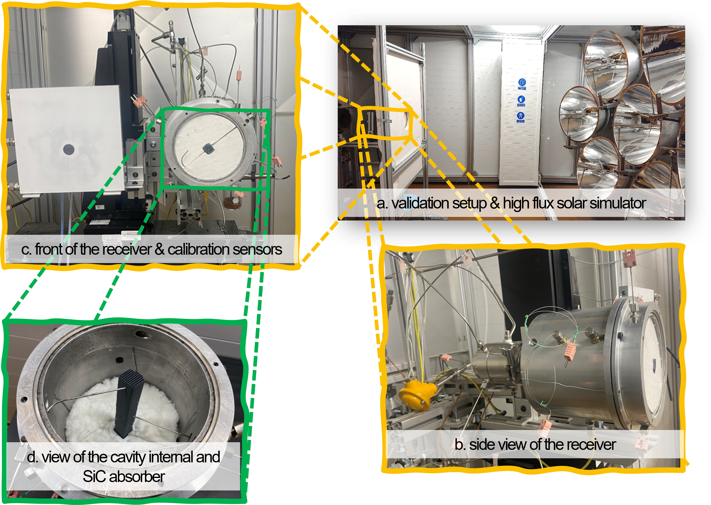
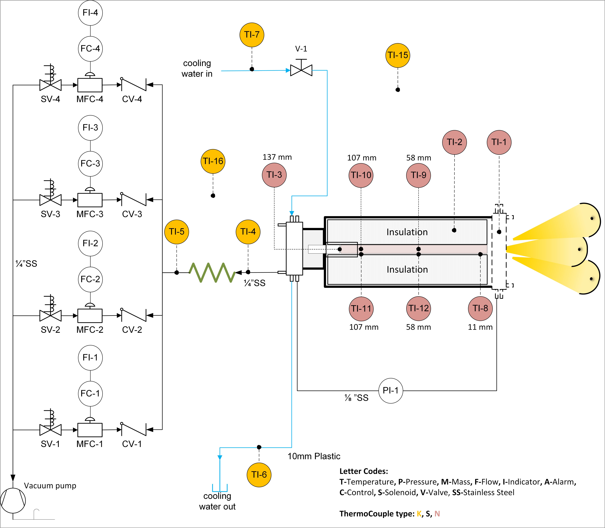
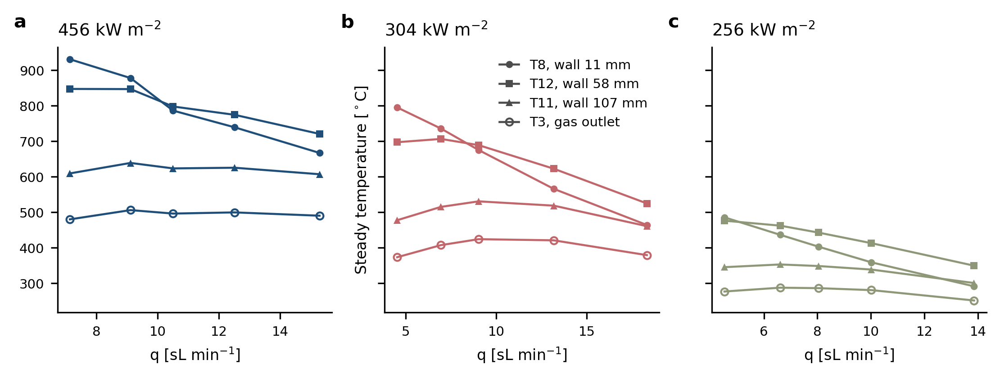
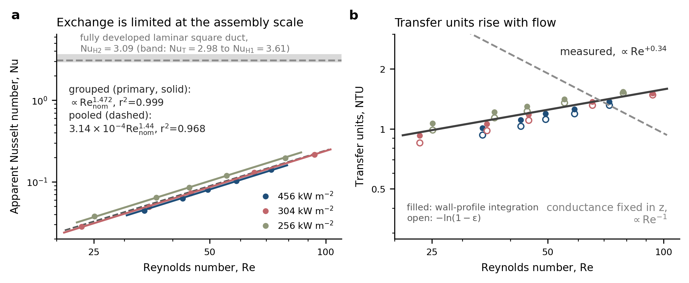
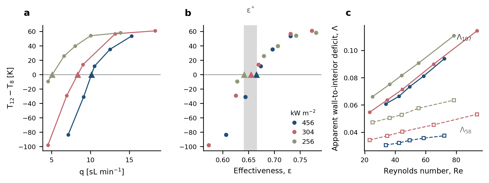
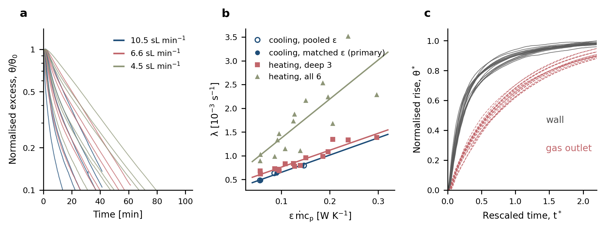
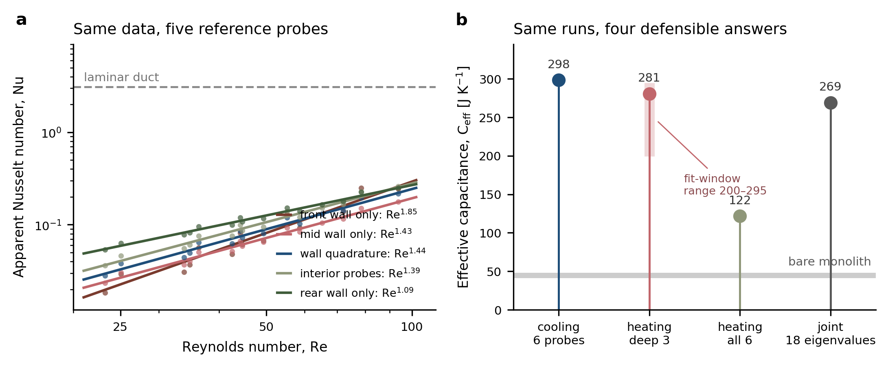

# Transient Thermal Characterization and Dimensionless Correlations for a Structured Silicon Carbide Volumetric Solar Receiver, with Consequences for Reduced-Order Model Validation

A. Melhim and K. E. Kakosimos

---

## Abstract

Volumetric solar receivers are meant to absorb concentrated radiation in depth and pass it to a heat transfer fluid (herein air) with little loss from the irradiated face, yet tested absorbers have repeatedly fallen short of the models used to design them. Those models are usually validated against an outlet air temperature and one or two solid temperatures, and this work asks how much such data can tell us about the receiver. A silicon carbide honeycomb receiver with 100 square channels of 1.5 mm side was instrumented at several depths and tested in a high-flux solar simulator at three irradiance levels and channel Reynolds numbers of 23 to 94, and its fifteen heating and three cooling transients were reduced without fitting a thermal model to them.

The measurements show that heat exchange between gas and solid is limited at the scale of the whole assembly rather than inside the channels: the apparent Nusselt number lies one to two orders of magnitude below the laminar duct value, and the transient response is governed by an effective capacitance of 275 ± 38 J K⁻¹, six to seven times that of the monolith alone. More consequential for modelling, the number of transfer units rises with flow, as $Re_{nom^+0.341}$, whereas any single-stream model whose heat transfer coefficient is a fixed function of axial position requires it to fall as $Re_{nom^−1.00}$. Because the disagreement is in sign rather than magnitude, no recalibration can remove it, and it suggests that what these models miss is the distribution of flow across the receiver. The same runs also show why the usual validation would not notice: depending only on which thermocouple represents the solid, the fitted correlation prefactor changes by a factor of nearly thirty and the identified capacitance spans 122 to 281 J K⁻¹. A model can therefore match the standard validation data while misrepresenting the receiver, which offers a potential explanation for the long-standing gap between predicted and measured absorber performance. We close by identifying the measurements, chiefly a properly ranged pressure drop across the monolith, that would turn these response indices into physical coefficients.

**Keywords:** volumetric solar receiver; silicon carbide honeycomb; local thermal non-equilibrium; transient identification; model validation; dimensionless correlation

---

## 1. Introduction

Volumetric solar receivers, one route to convert solar energy to thermal or chemical energy, distribute concentrated radiation into the depth of a porous or structured absorber so the solid temperature peak sits inside the material rather than on the irradiated face, suppressing reradiation from the hot front surface and raising attainable outlet temperature. State of the art analyses anticipate thermal efficiencies above 75% with air outlet temperatures beyond 1000 °C, silicon carbide absorbers usable to 1500 °C where metallic meshes are confined to 800–1000 °C [1]. Three decades of prototypes have delivered unevenly: the wire-mesh TSA absorber reached 85% efficiency at 700 °C outlet and the recrystallized SiC SOLAIR absorber 70–75% at 750 °C [3,6], but Sulzer 1 delivered 68% against 80% predicted by its own design code, and Catrec 2 was destroyed attempting to raise its 460 °C outlet temperature [1,6]. A recent review by He et al. [46] states that the theoretical volumetric effect has not been validated by experiment, and most tested absorbers perform worse than predicted, continuing what Ávila-Marín et al. reported earlier as well [3].

The experimentalists' response has largely been to characterise and refine absorber designs — foams and fibre meshes [4,5], graded-porosity wire meshes and SiC morphologies [6,7], single- against multi-layer ceramic foams [8], pore-diameter variations [9], reticulated-porous-ceramic cavity receivers [31], screen-printed and metallic-foil absorbers reaching 91.8% efficiency against 84.6–85.3% for the HiTRec SiSiC benchmark [29], and calorimetric benches across rectangular channel geometries [32] — yielding design recommendations on porosity, cell density, layering and channel aspect ratio from steady-state efficiency measurements (see SM S1 for more details on experimental campaigns).

<mark>In parallel, the reduced-order modelling literature treats the receiver most commonly as a simple porous continuum or a single channel, despite the complexities, with coupled local thermal non-equilibrium and radiation models. Kribus et al. [2] show an idealized absorber in local thermal equilibrium achieving above 95% efficiency at 800 kW m⁻² and 1000 °C, unrealistically optimistic against the roughly 70% real absorbers achieve; Fend et al. [11] reproduce an extruded SiC honeycomb to within 15 K in outlet temperature and two efficiency points, with the extinction coefficient of 2300 m⁻¹ measured independently by transmittance, but with the volumetric heat transfer coefficient computed from a finer single-channel model rather than measured; and Ávila-Marín et al. [13] develop homogeneous equivalent models with a P1 radiation approximation and close the gas–solid coupling with volumetric correlations of the form $Nu_{lv} = a Re^b Pr^c$, fitting the respective coefficients. Superposing separately computed conduction and radiation contributions fails to recover the coupled effective conductivity [14], and a Rosseland treatment can differ from discrete ordinates by up to 76% [15]. Our own group [16] showed specular rather than diffuse channel reflectivity flattens the source term and raises modelled efficiency to 96% against 85% for the commercial HiTRec-II geometry using a similarly simplified approach validated against a single data point. What these approaches share is that the gas–solid temperature difference is built into the formulation rather than observed, and how large this difference becomes is set by the volumetric coupling coefficient. However, that coefficient is taken from a correlation for another geometry, computed from a finer-scale model, or fitted to a few measured points.

The channel-scale physics has been analysed more carefully outside the solar field, in the catalytic-monolith literature, and — importantly for what follows — with its validity conditions stated explicitly. Cornejo, Nikrityuk and Hayes [17] computed laminar convection in monolith channels under constant wall temperature and constant wall heat flux across Re of 50–600, showing that evaluating the Péclet number at the inlet rather than at the local temperature introduces errors of 50% or more, and that at high heating rates a minimum appears in the Nusselt–Graetz curve some 16% below the asymptotic value. Effective axial and radial conductivities are established for honeycomb substrates [18], and the multi-scale comprehensive studies note radiation is required to reproduce measured axial temperature profiles and that a thermocouple inside a monolith channel can be significantly affected by radiation even without blocking the channel [19]. A 0.05 mm wall gap substantially reduces effective radial conductivity [20], and a pseudo-continuous two-dimensional reduction reproduces full three-dimensional CFD to better than 0.5 K [21]. These results, however, rest on assumptions their authors state: flow equally distributed over all channels [21], and the gas treated as static [20]. Because the assumptions are stated, it is easy to check them, and clearly they do not hold for an absorber under a concentrated, spilling beam and potentially without a uniform flow across the channels.

Neither family of studies, experimental or computational that we were able to collect, measures an installed receiver through its transients and reads the governing quantities directly off the measurement, which matters because calibration data for a reduced-order model are almost always a gas outlet temperature with one or two embedded solid temperatures. Capuano and co-workers [10] illustrate the consequence: reviewing four established DLR models against one reference experiment, they report predicted outlet air temperatures of 1050, 1048, 1057 and 1073 K against 972 K measured, and efficiencies of 0.78, 0.77, 0.79 and 0.81 against 0.69, attributing the gap partly to the difficulty of experimentally evaluating a mean air flow temperature. Four independently developed models agreeing with each other to within 25 K yet disagreeing with the experiment by 80–100 K signals a validation target that fails to constrain what the models disagree about.

This work, first, brings a new and extensive experimental dataset (in section 2) of eighteen transients — fifteen heating and three cooling — each recorded at nine axial and radial locations of a lab-scale receiver, for various gas flow rates and irradiance levels. Second, presents an analysis framework (in section 3) that reduces the measurements to dimensionless groups, identifies the receiver's constants from the transient eigenstructure, and tests the structure of reduced-order formulations against the measured exponent. Instead of an inverse calibration fitting a coefficient's value, it only explores which way the transfer-unit count moves as the flow rises. Any formulation whose volumetric conductance is a fixed function of axial position requires that count to fall in proportion to 1/ṁ, whereas the measurement herein has it rising; a disagreement in sign cannot be absorbed by recalibration, so the conclusion holds whatever coefficient is chosen. The framework also quantifies how much the identified coefficients depend on the researcher's choice of reference sensor, and thus how much information a conventional validation exercise carries. These yield (section 4) a dimensionless characterization of the installed SiC honeycomb receiver; the demonstration of the wall-to-interior disequilibrium based on the measurements rather than model fitting; identification of effective capacitance and loss conductance from transient eigenvalues with sensor-selection sensitivity quantified; a similarity rescaling on which the fifteen heating transients collapse. Finally, the work utilizes the experimental data and analysis framework to support two methodological findings (in section 5) — that validation against a gas outlet temperature plus one or two solid temperatures is largely uninformative for this class of receiver, and that a uniform-temperature or uniform-flux coefficient evaluated on the fixed channel geometry cannot reproduce its flow response at any calibration.

## 2. Experiment

### 2.1 Receiver and apparatus

The absorber is a monolithic silicon carbide honeycomb (Figure 1d) with a ten-by-ten array of square channels of 1.5 mm side and 0.40 mm web thickness, giving a 1.9 mm pitch, a 19.0 mm square frontal face of area 3.61 cm², an open frontal fraction of 0.6233 and an axial length of 137 mm. The measured mass is 40 g, which over the solid cross-section of 1.360×10⁻⁴ m² and the 137 mm length gives an effective bulk density of 2147 kg m⁻³, consistent with a recrystallized SiC of roughly one third internal porosity; this is the value used for every capacitance estimate below. The geometry is of the same family as the extruded SiC honeycombs and catalyst-carrier substrates characterized in the solar literature [4,11] and modelled in our earlier work [16], with a channel size between the two quoted literature samples (1.43 and 2.18 mm) and a comparable web thickness.

The monolith is enclosed in an aluminum cavity (142 mm in diameter, depicted in Figure 1b, and utilized earlier as a plain solar cavity [47]) held in place with multiple layers of alumina felt insulation (by Shine Refractories), and irradiated through a wider circular aperture by a seven-lamp high-flux solar simulator (Figure 1a), each lamp is a 6 kW xenon short-arc unit; the apparatus and its optical characterization (Figure 1c) are described in detail elsewhere [22,23]. The receiver is operated in suction: cavity air is drawn in through the irradiated face, passes through the monolith to the exit plenum, and leaves through a rear flange cooled by a closed water loop held at 25 °C, so that the gas reaching the metering line is near ambient. The drop across that flange is large and is measured — 15 to 442 K between the plenum probe and the station immediately downstream of it across the campaign — which is why no station in the return line is used as the inlet reference. Air is metered by four Aalborg GFC17 thermal mass-flow controllers (MFC) of nominal 0 to 5 sL min⁻¹ range, all carrying air, referenced to 21.1 °C and 1 atm, and the total flow is their sum. Four units were used in place of a single 0 to 20 sL min⁻¹ device because the manufacturer specification is ±1.0% of full scale over the whole 0 to 100% range with ±0.5% full-scale repeatability, so subdividing the range reduces the absolute error provided the unit errors are not fully correlated, and section 3.4 reports both correlation limits for that reason. Only one of the four MFCs carries a factory calibration for air; the other three are calibrated for different gases, so their indicated flow is converted, which scales each unit's air-equivalent range by its own conversion factor and takes the widest to 5.72 sL min⁻¹. Rather than rely on the manual's conversion factors, each unit was calibrated in place against a bubble flowmeter, which replaces the factors with a directly measured characteristic and leaves a residual proportional to reading. Both terms are carried in the uncertainty model of section 3.4. Per-unit readings span 0.69 to 5.72 sL min⁻¹, from the smallest set point the controllers hold — 10% of nominal range, below which flow was not controllable — to full range, so neither term is negligible against the other. Because these are mass-flow devices reporting standard volumetric units, the mass flow follows from the reference density ρ_std = 1.1996 kg m⁻³ rather than from the density at the prevailing ambient temperature.

### 2.2 Instrumentation

Figure 2 shows the piping and instrumentation diagram (P&ID), mainly the nine sheathed thermocouples (sensors/probes) characterizing the measuring campaign: six of type N (TCDirect UK) and three of type K (Omega UK). Of which, three probes (type N, OD 1.5 mm, length 150 mm) contact the monolith side wall at axial positions of 11, 58 and 107 mm, denoted T8, T12 and T11 (TI-8, TI-12 and TI-11 in Figure 2). Two probes (OD 0.5 mm, length 500 mm) sit in the interior, flow-exposed region at 58 and 107 mm, denoted T9 and T10. One probe, T3 (type N, OD 1.5 mm, length 300 mm), sits in the exit plenum and reports the outlet gas temperature. One further probe, T2 (type K, OD 1.5 mm, length 150 mm), sits in the surrounding insulation and is used in section 4.6 to assess thermal stationarity; the wall-to-insulation drop T12 − T2 is 310 to 770 K, so the insulation resistance dominates radial transfer. The remaining two probes, T15 and T16 (both type K)  placed a few cm behind and beside the cavity, respectively, give the setup's mean ambient temperature, T_amb. They are the least drifting temperatures in the rig, warming by 1.6 and 1.8 K between the first two minutes of a run and its steady window against 3.3 K for the probe downstream of the gas cooler, so the inlet reference is taken from them rather than from any station in the return line. Substituting either probe alone for their mean moves every quantity identified below by less than a tenth of its Monte Carlo standard deviation. The distinction between the wall chain and the interior pair is critical for this work. Sections 4.3 and 5.1 show that the two report materially different temperatures at the same depth, and that which is taken to be the solid temperature changes every identified coefficient in this work. Interior probe readings in similar geometries are known to be perturbed by the radiation field [19], which is why we treat the reference-temperature choice as a systematic rather than a detail. Thermocouple tolerance is treated per IEC 60584 class 1, which sets the same limit for type N and type K — the greater of 1.5 K and 0.004|t| with t in °C — and which at the hottest front-probe reading of 1204 K is ±3.7 K. Installation error for the three sheathed wall probes, comprising contact resistance against the monolith and radiative exchange with the cavity, is not quantified.

Differential pressure across the monolith is monitored with a Keller PD33X of ±200 mbar range and ±0.1% full-scale accuracy (PI-1 in Figure 2, hereafter DP1), hence an accuracy floor of ±0.2 mbar. Section 4.7 shows this to be the same order as the entire expected monolith pressure drop, so the sensors readings are not useful. Nonetheless, these are still presented because a corrective action has be devised since the quantity of pressure drop can assist on discriminating between the two mechanisms discussed in section 5.2.

### 2.3 Campaign and reduction

Fifteen heating runs span three lamp configurations at nominal aperture irradiances of 456, 304 and 256 kW m⁻²: runs E67–E71 at 7.1 to 15.3 sL min⁻¹, E72–E76 at 4.5 to 18.3 sL min⁻¹, and E77–E81 at 4.5 to 13.8 sL min⁻¹ respectively. Three cooling transients, C69, C80 and C81 at 10.5, 6.6 and 4.5 sL min⁻¹, follow lamp shutdown of the heating runs E69, E80 and E81 respectively, with flow maintained. Two additional runs, E82 and E83, repeat E77 and E81; they are retained in the dataset for repeatability check but excluded from every fit reported here. All raw data are available in the work's repository (see Data Availability section)

Steady-state values are 120 s means at the end of each heating run. The length-averaged wall temperature is the length average of the piecewise-linear profile through the three wall thermocouples with constant extrapolation to the end faces,

$\bar T_w = 0.2518\,T_8 + 0.3504\,T_{12} + 0.3978\,T_{11},$

using the exact trapezoid coefficients for thermocouples at 11, 58 and 107 mm over 137 mm. Gas enthalpy differences are computed by trapezoidal integration of $c_p(T)$ between T_amb and the relevant gas temperature rather than as $c_p(T̄)ΔT$. The measured conditions of the fifteen steady runs are collected in Table 1.

---

**Figure 1.** The experimental assembly: a) The seven-lamp high-flux solar simulator with the receiver mounted on its optical axis; b) Side view of the receiver, showing the cylindrical aluminium cavity and the thermocouple leads entering through its wall; c) Front of the receiver with the alumina-coated Lambertian target and the calibration sensors used for the flux mapping of section 4.6; d) View of the opened cavity (without most of the insulation layers), showing the silicon carbide honeycomb seated in alumina felt insulation. Sensor axial positions are given in Figure 2.

---

**Figure 2.** Piping and instrumentation diagram (P&ID), with the letter codes and thermocouple type colour codes given in the panel.

---

| Run | $G_0 [kW m^{-2}]$ | $q [sL min^{-1}]$ | $T_{\rm amb} [K]$ | $\bar T_w [K]$ | $T3 [K]$ | $T12-T8 [K]$ |
| --- | -----------------:| -----------------:| -----------------:| --------------:| --------:| ------------:|
| E81 | 256               | 4.53              | 297.8             | 700            | 550      | -9.4         |
| E80 | 256               | 6.61              | 296.6             | 686            | 561      | +25.8        |
| E79 | 256               | 8.04              | 296.7             | 669            | 560      | +39.6        |
| E78 | 256               | 10.01             | 298.1             | 643            | 554      | +54.0        |
| E77 | 256               | 13.85             | 297.1             | 589            | 525      | +58.1        |
| E76 | 304               | 4.53              | 296.4             | 908            | 647      | -97.9        |
| E75 | 304               | 6.95              | 296.7             | 911            | 681      | -29.1        |
| E74 | 304               | 9.03              | 296.5             | 896            | 697      | +13.8        |
| E73 | 304               | 13.17             | 296.9             | 840            | 694      | +56.6        |
| E72 | 304               | 18.32             | 296.4             | 757            | 653      | +60.7        |
| E71 | 456               | 7.13              | 300.8             | 1047           | 753      | -83.5        |
| E70 | 456               | 9.11              | 299.0             | 1045           | 779      | -31.1        |
| E69 | 456               | 10.50             | 296.7             | 999            | 770      | +11.5        |
| E68 | 456               | 12.50             | 298.7             | 979            | 773      | +35.1        |
| E67 | 456               | 15.28             | 296.3             | 935            | 764      | +53.5        |

**Table 1.** The 15 heating conditions (measured quantities and fixed averages) of the campaign ordered by irradiance then flow rate.

---

## 3. Analysis framework

This chapter defines the quantities the campaign's experimental data is reduced to. All are computed directly from the measured records; no thermal or radiation model of the receiver is fitted to them. This approach yields steady state dimensionless groups treating the assembly as a single-stream heat exchanger (section 3.1), an effective capacitance and loss conductance identified from the transient decays (section 3.2), a rescaling that tests the lumped description those identifications presume (section 3.3), and the uncertainty accounting (section 3.4). Dependencies on additional, to the methodology framework assumptions, and other reference choices are declared in place. The chapter closes with the details implementation of the framework along with the necessary libraries and packages (section 3.5).

### 3.1 Dimensionless groups

Per-channel mass flow is $ṁ_{ch} = ṁ/100$ and the hydraulic diameter is the channel side, $D_h$ = 1.5 mm. Gas properties are evaluated at $T̄_g = (T_{amb} + T_3)/2$ except the thermal conductivity in the Nusselt number, which uses the film temperature $(T̄_w + T̄_g)/2$ — as discussed earlier, because evaluating the Péclet number on an inlet rather than a local temperature shifts the apparent Nusselt–Graetz curve by 50% or more [17].

The receiver is characterized as a single-stream heat exchanger following Kays and London [25], with effectiveness (ε) and transfer-unit count (NTU)
$\varepsilon = \frac{T_3 - T_{\rm amb}}{\bar T_w - T_{\rm amb}}, \qquad NTU = -\ln(1-\varepsilon),$

giving an apparent assembly-level coefficient $h_{app}$ and Nusselt number:

$h_{\rm app} = \frac{NTU\,\dot m_{\rm ch} c_p}{P L}, \qquad Nu = \frac{h_{\rm app} D_h}{k(T_{\rm film})}.$

Re is evaluated with ṁ/100, assuming equal division of metered flow among the hundred channels — an assumption sections 5.2 and 5.3 argue is violated — so a nominal Reynolds number, $Re_{nom}$, is required. Similarly, $NTU_{app}, h_{app}$ and $Nu_{app}$ are calculated algebraically from the outlet-plenum probe T3 and an axial wall average, in the absence of independently measured interfacial coefficients. All four are considered installed-receiver response indices, appropriate for the heat transfer analysis herein but not explicit transport coefficients and transferable to another geometry; extracting physical coefficients is left to a follow companion modelling study.

Two important notes. First, the ε–NTU relation is exact for a wall at fixed temperature, whereas here the wall spans up to 321 K between T8 at the front and T11 at the back, and the maximum sits in the interior: the axial profile inverts, with T12 above T8 in 10 of the 15 runs. The inversion's onset moves to higher flow as irradiance rises: the lowest flow at which it is observed is 6.6, 9.0 and 10.5 sL min⁻¹ at 256, 304 and 456 kW m⁻², bracketing interpolated onsets of 5.1, 8.4 and 10.1 sL min⁻¹ (Table 3). The bias is quantified in section 4.2. A side-wall inversion indicator ΔT_w = T₁₂ − T₈ is used throughout: negative while the front-face probe is the hotter, positive once mid-depth overtakes it. Second, since $h_{app}$ is defined through NTU, Nu(Re) is algebraically tied to ε(Re):

$\frac{d\ln Nu}{d\ln Re} = 1 + \frac{d\ln NTU}{d\ln Re} + \frac{d\ln[c_p/k]}{d\ln Re}$.

Because  $c_p$ is evaluated at the bulk mean and *k* at the film temperature the ratio $c_p/k$ is being used rather calling it a Prandtl number. A fitted Nu(Re) exponent is therefore not independent corroboration of the measured ε(Re); the flow dependence that carries information is that of the transfer-unit count, and section 5.2 makes the respective comparison.

The apparent wall-to-interior disequilibrium is expressed by the below Λ ratios, at each of the two receiver depths (58 and 107 mm) which are utilized as a surrogate of gas–solid nonequilibrium in section 4.3:

$\Lambda_{58} = \frac{T_{12}-T_9}{T_{12}-T_{\rm amb}}, \qquad \Lambda_{107} = \frac{T_{11}-T_{10}}{T_{11}-T_{\rm amb}}.$

Finally, four dimensionless groups are used in section 5.2 to capture the physics: Biot number $Bi = h_{app} t_w/2k_{SiC}$, Graetz number $Gz_L = D_h Re Pr/L$, axial Péclet group $Re·Pr·L/D_h$, and radiation–conduction number $N_{rc} = 4σT̄_w³D_h/k(T̄_w)$.

### 3.2 Transient identification

After lamp shutdown, during cooling runs, the assembly's temperature decays with a single slow mode. For each sensor (probe) the excess temperature over the second half of the record, and above 5 K, is regressed as $\ln(T-T_{\rm amb})$ against time, and λ is the mean of the per-sensor slopes. Lumping the assembly's thermal behaviour into one capacitance $C_{eff}$ losing heat to ambient through a conductance $K_{loss}$ while delivering enthalpy to the gas gives:

$\lambda = \frac{\varepsilon \dot m c_p + K_{\rm loss}}{C_{\rm eff}}.$

So regressing the obtained λ against the gas advective conductance $x = ε ṁ c_p$ allow identification of both constants from slope and intercept with no need for solving a more complex mathematical model. Note that, each cooling transient is paired with the heating run sharing its identifier (E*XX*/C*XX*) and takes that run's effectiveness. 

Identifying a heat transfer property from a transient rather than from a steady balance is established practice for these materials with Fend et al. [4] showing how volumetric heat transfer coefficients of porous absorbers have been obtained by measuring how far a temperature wave is delayed and damped in passing through a sample. The same logic is applied here to the full assembly.

In principle the heating branch decays with the same eigenvalue, and $\ln(T_{\rm ss}-T)$ is regressed against time in the same way. It differs in that the asymptote $T_{ss}$​ is estimated from the tail of the same record, which forces a choice of fit window. We use the middle of that record, 0.07<u<0.45, where $u=(T_{ss}​−T)/(T_{ss}​−T_0​)$ is the fraction of the total rise still to come - equal to 1 at lamp-on and 0 at steady state. Earlier than u=0.45 the faster modes have not yet decayed; later than u=0.07 the remaining deficit is comparable to the uncertainty in $T_{ss}$​ itself. The choice of the window is not arbitrary. Sweeping the window from (0.05, 0.35) to (0.20, 0.70) moves $C_{eff}$​ monotonically from 295 to 200 J K⁻¹ while $r^2$ improves from 0.84 to 0.97, so fit quality cannot select it (see also SM S3). Furthermore, the temperature probe set alone changes $C_{eff}$​ by more than a factor of two (discussed in section 4.4).

We therefore report cooling as the primary identification, since its asymptote is measured and it needs no probe rule once the source is removed; heating remains as a conditional consistency check; and a joint fit to all eighteen eigenvalues offers an overall estimate. Their disagreement is addressed in section 5.1.

### 3.3 Similarity rescaling

If the lumped description holds, every temperature transient should collapse when time is rescaled on the identified eigenvalue as $t* = t/τ$ with a time constant of $τ = C_{eff}/(ε ṁ c_p + K_{loss})$. The ε factor enters τ because it is the effectiveness that converts the metered flow into the conductance the eigenvalue actually sees; both the reference constants and the effectiveness are taken from the primary identification and from each run's own measured effectiveness. The resulting half-rise is a property of the receiver's response shape rather than a quantity with a predicted value: only an ideal single-node system would give ln 2, and the departure from ln 2 measures how far the receiver is from a single state.

### 3.4 Uncertainty

The uncertainty of the calculated quantities is propagated through each measurement, based on the instruments' specification, and calculation step. Since all the framework is implemented over a computer script (see section 3.5) it is advantageous to utilize a Monte Carlo simulation [50] for uncertainty propagation and estimate it across many "realizations". One realization perturbs every measured input by a random draw (ie Monte-Carlo random selection) from its specified error and repeats the entire reduction on the perturbed record; after testing various counts, four thousand realizations give a representative and count-independent ensemble for each derived quantity, whose spread is the reported uncertainty. Because each physical error is drawn once and applied wherever it acts, correlations between derived quantities are carried by the ensemble rather than assumed. Three kinds of uncertainty are propagated and reported separately : i) Instrument error, ii) systematic bias, and iii) estimator choice 

#### Instrument (random and calibration) error

For the thermocouples, the IEC 60584 class 1 type N  and K tolerance — the greater of 1.5 K and 0.004|t| — is a maximum permissible error rather than a standard deviation, so it is read as a 95% coverage bound and is halved to a 1σ systematic term, drawn once per sensor per realization and shared across runs, with an independent 0.5 K drift term per run; viscosity and conductivity carry 2% and 1% perturbations. 
The metered flow sums four controllers carrying roughly 25, 33, 28 and 14% of the total, and their error is two-term because the two available pieces of information constrain different things: the manufacturer specification is ±1.0% of full scale with ±0.5% full-scale repeatability, an additive bound in absolute flow, while the in-house bubble-flowmeter calibration constrains the slope of each unit's characteristic and so contributes a term proportional to reading. Each unit's deviation therefore is $σ = [(0.0025 F)² + (0.025 q_u)²]^{1/2}$, drawn once per unit per realization and combined with each record's own measured shares. F is the unit's air-equivalent full scale, the nominal 5 sL min⁻¹ scaled by its gas-conversion factor; instead of using the four individual factors we assign every unit the widest, F = 5.72 sL min⁻¹, which over-states the additive term and is therefore conservative. The two terms (manufacturer specification and bubble-flowmeter calibration) have opposite flow dependence, so the relative uncertainty on the summed flow falls from 2.8% at the lowest campaign flow to 2.5% at the highest for fully correlated units, and from 1.4% to 1.3% for independent ones. The two limits agree to within 0.0001 on every exponent and 0.5 J K⁻¹ on every capacitance, so which of them is used is immaterial; hereafter the larger is quoted with the flow error being predominantly systematic. 
All fitted-slope quantities are accompanied by the regression standard error. For the pooled correlation and the transfer-unit count of section 4.2 that standard error exceeds the instrumental term by an order of magnitude and therefore this should be used as the uncertainty; for the better determined grouped correlation it exceeds the instrumental term only 3.3-fold (SM S2 details the propagation).

#### Systematic Bias

Systematic bias in the outlet gas thermocouple is propagated with the selected range being much larger than the calibration error. T3, in the exit plenum, sits at a convective–radiative equilibrium between gas and hardware and reads neither bulk gas nor wall temperature; the bias is potentially of order tens of kelvin and uncharacterized — a principal source of the model–experiment gap in this field [10], demonstrated for thermocouples in monolith channels specifically [19]. T3 enters ε, NTU, $h_{app}$​, Nu, ε\* and η directly. It reaches $C_{eff}$​ and $K_{loss}$​ only through the effectiveness, which forms the abscissa $x=εm˙c_p$​ of the eigenvalue regression. Each therefore carries a δT3 = ±25 K band alongside its Monte Carlo interval, evaluated on the transient identification as well as on the steady groups. Section 4.4 evaluates it and finds the identified capacitance to be the quantity least sensitive to the outlet-thermocouple systematic. Its impact is further discussed in section 5.2.

#### Estimator choice

Where more than one reduction paths (referred as estimator choice) exists, as for the inversion threshold ε\*, their individual uncertainty propagation is estimated. Specifically, section 4.1 reports ε* as estimated both by interpolation between bracketing runs and by global linear regression, considering this a systematic difference potentially affecting the analysis conclusions.

### 3.5 Implementation

The reduction and figure generation are implemented as two Julia 1.12.6 scripts (available, for details check Data Availability and Reproducibility) executed in the repository environment , with dependencies fixed by `Project.toml` and `Manifest.toml`. `receiver_reduction.jl` reads the raw logger records and generates all reduced data, regressions, uncertainty estimates, tables and the JSON results archive using CSV 0.10.16 and DataFrames 1.8.2 for data handling, GLM 1.9.5 for linear regression, Roots 3.0.4 for scalar inversions, Optim 2.2.1 with ForwardDiff 1.4.1 for the multi-start conductance-profile fits, Interpolations 0.16.3 and Trapz 2.0.3 for property interpolation and enthalpy integration, and JSON3 1.14.3 for serialization. `make_figures.jl` imports the shared reduction definitions without rerunning the complete reduction, regenerates plotting traces from the raw records when required, and renders Figures 3–7 using PythonPlot 1.0.6 with Matplotlib 3.9.1. Dry-air properties at 1 atm are evaluated using CoolProp 8.0.0 through the Julia `CoolProp_jll` binary: the Helmholtz equation of state of Lemmon and co-workers supplies ($c_p$) \[48], while the Lemmon and Jacobsen correlations supply viscosity and thermal conductivity \[49], consistent with the formulations used by REFPROP. Because `PropsSI` is a scalar call whereas the two 4000-realization Monte Carlo cases evaluate these properties several million times, CoolProp is queried once when the script is loaded on a 1 K grid spanning 200–1600 K, after which the call sites use linear interpolation. The interpolation error remains below $(10^{-6}$) relative over 250–1500 K, and the grid brackets the campaign range of approximately 294–1200 K, so no experimental evaluation requires extrapolation. The Monte Carlo propagation and multi-start optimizer use fixed random seeds; consequently, rerunning the scripts with the archived Julia environment reproduces the outputs, apart from possible last-digit differences between numerical-library builds.

## 4. Results

The reduced quantities for every run, referred to throughout this section, are given in Table 2; the measured conditions they derive from are in Table 1.

| Run | $Re_{\rm nom}$ | $Gz_L$ | $\varepsilon$ | $NTU_{\rm app}$ | $N_{\rm prof}$ | $Nu_{\rm app}$ | $\Lambda_{58}$ | $\Lambda_{107}$ | $\eta_{\rm nom}$ |
| --- | --------------:| ------:| -------------:| ---------------:| --------------:| --------------:| --------------:| ---------------:| ----------------:|
| E81 | 25.1           | 0.192  | 0.628         | 0.988           | 1.065          | 0.0380         | 0.0472         | 0.0661          | 0.252            |
| E80 | 36.3           | 0.277  | 0.680         | 1.138           | 1.213          | 0.0642         | 0.0505         | 0.0751          | 0.385            |
| E79 | 44.2           | 0.338  | 0.707         | 1.227           | 1.296          | 0.0853         | 0.0528         | 0.0817          | 0.466            |
| E78 | 55.3           | 0.422  | 0.742         | 1.355           | 1.408          | 0.1197         | 0.0576         | 0.0907          | 0.565            |
| E77 | 78.5           | 0.600  | 0.781         | 1.518           | 1.540          | 0.1951         | 0.0635         | 0.1108          | 0.694            |
| E76 | 23.2           | 0.178  | 0.573         | 0.851           | 0.925          | 0.0282         | 0.0343         | 0.0547          | 0.297            |
| E75 | 34.7           | 0.266  | 0.625         | 0.982           | 1.058          | 0.0494         | 0.0374         | 0.0636          | 0.501            |
| E74 | 44.6           | 0.341  | 0.669         | 1.106           | 1.179          | 0.0727         | 0.0404         | 0.0714          | 0.681            |
| E73 | 65.2           | 0.499  | 0.731         | 1.314           | 1.369          | 0.1302         | 0.0455         | 0.0900          | 0.985            |
| E72 | 93.6           | 0.715  | 0.773         | 1.481           | 1.512          | 0.2162         | 0.0531         | 0.1144          | 1.223            |
| E71 | 33.8           | 0.259  | 0.607         | 0.933           | 1.011          | 0.0444         | 0.0306         | 0.0608          | 0.407            |
| E70 | 42.5           | 0.326  | 0.644         | 1.032           | 1.109          | 0.0627         | 0.0322         | 0.0664          | 0.554            |
| E69 | 49.4           | 0.378  | 0.674         | 1.120           | 1.192          | 0.0802         | 0.0340         | 0.0733          | 0.628            |
| E68 | 58.6           | 0.449  | 0.697         | 1.192           | 1.257          | 0.1027         | 0.0357         | 0.0812          | 0.750            |
| E67 | 72.2           | 0.553  | 0.731         | 1.315           | 1.369          | 0.1417         | 0.0374         | 0.0939          | 0.902            |

**Table 2.** The per-run quantities that follow from the definitions of section 3 (reduction framework). Runs are ordered by irradiance then flow rate, as in Table 1.

### 4.1 Steady field, flow response, and the inversion criterion

The steady temperatures against flow at each configuration are shown in Figure 3, and the response is strongly graded in depth. Front-face wall temperature falls steeply with flow, at −33.2, −24.3 and −20.8 K per sL min⁻¹ at 456, 304 and 256 kW m⁻² with r² of at least 0.97; the mid-depth wall falls at half to two-thirds that rate; the rear wall barely falls, at −1.1, −1.9 and −5.2 K per sL min⁻¹ with r² of 0.07, 0.12 and 0.76. Outlet gas temperature is nearly flow-invariant at the two higher fluxes (+0.6 and −0.1 K per sL min⁻¹, r² ≤ 0.03) and falls only weakly at the lowest, at −3.1 K per sL min⁻¹. At 456 kW m⁻² the outlet gas spans 26 K across the flow range against 264 K for the front-face wall, a ratio of ten; at 304 and 256 kW m⁻² the spans are 51 K against 331 K and 36 K against 194 K respectively.

**Figure 3.** Steady and outlet gas temperatures against flow rate at the three lamp configurations.

Figure 5 presents the analysis of the axial temperature profile and, in particular, its inversion; Table 3 gives the condition at which the inversion occurs, expressed both as a flow rate and as an effectiveness ε. The side-wall profile inverts as flow increases, crossing zero within the tested range at all three configurations (Figure 5a), and the crossings collapse when expressed in effectiveness rather than flow (Figure 5b). However, there are two aspects to be considered before the threshold is read as a universal number. First, the inversion indicator is the difference between two side-wall probes, at 11 and 58 mm, so what it locates is a front-to-mid crossing along the receiver's axis, but measured on the wall. The true temperature maximum is three-dimensional and need not lie on that wall, since the light beam is Gaussian and carries radial gradients; the radial traverse proposed in section 5.3 would locate it. Second, the inversion threshold also depends on how the effectiveness is formed: ε* uses the length-averaged wall temperature, and section 5.1 shows that its value changes when the reference probe changes. ε* is therefore an operating criterion for this receiver and its instrumentation rather than a property of the receiver.

| Nominal $G_0$ [kW m⁻²] | $q^*$ local [sL min⁻¹] | $\varepsilon^*$ local | $q^*$ global | $\varepsilon^*$ global |
| ----------------------:| ----------------------:| ---------------------:| ------------:| ----------------------:|
| 456                    | 10.12                  | 0.666 ± 0.002         | 11.08        | 0.673                  |
| 304                    | 8.36                   | 0.655 ± 0.002         | 10.32        | 0.673                  |
| 256                    | 5.08                   | 0.642 ± 0.003         | 3.69         | 0.628                  |

**Table 3.** Located inversion crossings at the three configurations, by local interpolation between the bracketing runs and by global linear regression, with the effectiveness at crossing.

While the two estimators agree to within 0.02 in ε* (Table 3), they disagree enough to matter. At 256 kW m⁻² the global regression puts the crossing at 3.69 sL min⁻¹, 18% below the lowest flow run at that flux: only one of the five points in that group is below zero, and the indicator rises steeply from it before flattening, so a single straight line is too shallow at the bottom and carries the crossing outside the data. Local bracketing between the two runs that straddle zero keeps all three crossings inside the measured range and halves the ε* spread, from 0.045 to 0.024; therefore it is the estimator adopted here.

The data support a crossing at ε* ≈ 0.65, rising weakly from 0.642 to 0.666 as the flux rises 1.8-fold. The experimental parameter space is not sufficient to claim either flux independence or a resolved flux dependence. Although the 0.024 spread of effectiveness is well above the 0.002–0.003 Monte Carlo intervals (Table 3), it is still no larger than the difference between the two estimators. In any case, the form of the criterion is robust because the inversion is set by how much of the available wall-to-ambient temperature difference the gas has recovered, not by flow rate or flux separately. Its value, however, depends on the outlet probe: under the δT3 = ±25 K band, ε* at 256 kW m⁻² runs from 0.579 to 0.704.

### 4.2 Assembly-scale heat exchange behaviour

As per Shah and London [24] the fully developed laminar square-duct reference depends on thermal boundary condition and in their work they offer three standardized cases for unity aspect ratio: $Nu_T$ = 2.976 for a uniform wall temperature, $Nu_{H2}$ = 3.091 for a uniform wall heat flux both axially and peripherally, and $Nu_{H1}$ = 3.608 for a uniform axial flux with an isothermal perimeter, with the product $f \cdot Re = 14.227$ throughout. The two flux conditions differ only in whether the wall conducts heat around the channel perimeter. We adopt $Nu_{H2}$ as primary reference, since interior channels see similar radiative and convective conditions on all four walls and thin webs make a peripherally uniform flux the better idealization than a uniform temperature - in conjuction with the negligible web Biot number reported later. Nonetheless and irrespective of the reference case, the measured $Nu_{app}$ (see Table 2) is a factor of 14.3 to 110 below $Nu_{H2}$, comparably far below channel-level Nusselt numbers of order three to four computed for monolith channels under either boundary condition [17]. These point to a rather limited heat transfer exchange at the full assembly scale and not necessarily at the channel (film) level.

Over the full campaign (Figure 4a), the apparent Nusselt number follows a clean power law ,
$$Nu_{\rm app} = (3.14 \pm 0.11)\times10^{-4}\, Re_{\rm nom}^{1.444}, \qquad r^2 = 0.968,\ n = 15,$$
with pooled (all data together) regression standard error ±0.072 and instrumental Monte Carlo term ±0.003; the regression term exceeds the instrumental one roughly twentyfold, so residual dispersion is physical and not driven by metrology or random errors. Fitted separately per irradiance configuration the exponent is 1.440, 1.476 and 1.530 at 256, 304 and 456 kW m⁻² (r² ≥ 0.9996 each), so pooled scatter reflects a flux-ordered offset plus a weak monotonic trend in the exponent. A common-slope model with a separate prefactor per irradiance configuration gives exponent 1.472, regression SE ±0.011, instrumental term ±0.003, r² = 0.9993, and prefactors 3.24, 2.72 and 2.55 ×10⁻⁴ in the same order. This grouped model is reported as the primary correlation alongside the pooled fit, because it is the better determined of the two and because the data were acquired at three discrete irradiance levels rather than over a continuous sweep.

**Figure 4.** a) Apparent Nusselt number against nominal channel Reynolds number, with the fully developed laminar square-duct literature reference $Nu_{H2}=3.09$ and the band spanning the other two thermal boundary conditions, $Nu_T=2.98$ to $Nu_{H1}=3.61$ [24]. Solid lines are the primary common-slope grouping per irradiance level; the dashed line is the pooled (all together) single-fit; b) Profile-corrected transfer-unit count against Reynolds number (filled symbols) with the isothermal-wall identity $-\ln(1-\varepsilon)$ (open symbols), and the respective slope fit on Reynolds number (solid line), against the $Re^{-1}$ requirement of a conductance that is a fixed function of axial position (dashed line).

As section 3.1 established, the Nusselt exponent is the effectiveness trend with a definitional unit added to it, so the quantity carrying independent information is the transfer-unit count — a dimensionless measure of how much heat exchange the gas actually receives over the monolith length. Integrating the gas energy equation through the measured piecewise-linear wall profile with a uniform $h$, and solving for the $N = hPL/ṁc_p$ that reproduces each run's measured outlet temperature, gives (Figure 4b)
$$N_{\rm prof} \propto Re_{\rm nom}^{+0.341},\qquad \pm0.004\ \text{(instrumental)},\ \pm0.040\ \text{(regression SE)},\qquad r^2 = 0.845,$$
These counts exceed the isothermal-wall identity values by 1.5% to 8.7%, largest at low flow where the axial wall gradient is steepest, and the identity itself gives $NTU_{app} ∝ Re_{nom}^{(+0.389 ± 0.045)}$. The wall temperature profile is not available over the full length, since the probes start at 11 mm and finish at 107 mm, leaving the front 11 mm and rear 30 mm of the monolith unmeasured. Of the six plausible extrapolations considered, four yield admissible profiles; the two using a full linear continuation of the rear gradient are excluded because, for five of the fifteen runs, they place the exit wall temperature below the measured outlet gas temperature, which no single-stream model can produce. All admissible extrapolations move the exponent at the ±0.01 level, two orders of magnitude below the disagreement established next (SM S4 presents the full analysis)

Transfer units increase with flow, and that direction is unavailable to an entire class of models. For a single gas stream exchanging heat with a solid whose volumetric conductance is any fixed function of axial position — ie h(z) independent of mass flow — the transfer-unit count is given by,
$$N = \frac{1}{\dot m c_p}\int_0^L h(z)\,P\,dz \;\propto\; \dot m^{-1} \;\propto\; Re^{-1}$$
with no adjustable constant. The physical consequence of this is that a conductance fixed in position (ie only as function of length) has a fixed total over the monolith length, so raising the mass flow gives each unit of gas heat capacity a smaller share of it, and the exchanger must become less effective rather than more. Evaluated on the measured properties the requirement is −1.000 for a fixed Nusselt number and −1.016 for a conductance independent of temperature and flow, the two differing only through the temperature dependence of the gas properties; we write it as −1.00 below. The measured exponent is +0.341: a gap of 1.34 in the power of Re, and a disagreement in sign. The sign is what makes the result structural, since a mismatch in magnitude can be absorbed by recalibrating the coefficient, whereas no flow-independent h(z) — however large, however distributed along the channel — can turn a count that must fall into one that rises. Neither is it an artifact of the outlet probe: under a uniform δT3 = ±25 K offset the exponent moves only from +0.320 to +0.377, staying positive and over eight standard errors from zero, let alone from −1.00. This is one of main contributions of this work and further elaborated in section 5.2.

The dimensionless groups (estimated as per section 3.1) validate the transport phenomena of the cases studied here. Beyond $Re_{nom}$ and $Gz_L$, which are given per run in Table 2, the remaining auxiliary groups are tabulated in SM S5. The web Biot number never exceeds 3.4×10⁻⁵, so the solid is isothermal across the web thickness, consistent with the high effective conductivities reported for honeycomb substrates [18] and with SiC at the conductive end of the substrates compared by Cui and Kær [20]. The Graetz number reaches only 0.704; its reciprocal, $x* = 1/Gz_L$, runs from 1.42 at the highest flow to 5.71 at the lowest, against a fully developed asymptote reached at x* of order 10⁻¹ [24], so the thermal entry region occupies only a few percent of the channel length at every condition. The axial Péclet group is at least 1460, so axial gas conduction is negligible, and the radiation–conduction number is 1.50 to 5.66, so the solid redistributes absorbed energy axially by radiation — consistent with radiation being required to reproduce measured axial temperature profiles in monolith channels [19]. Further interpretation of these groups, and what they exclude as explanations of the flow response, is taken up in section 5.2.

### 4.3 Local nonequilibrium

Figure 5c presents the wall-to-interior disequilibrium at the two instrumented depths (58 and 107 mm), each normalised on its own wall-to-ambient difference. Both disequilibrium indices rise linearly with Reynolds number within every flux group and both are small in magnitude, Λ₅₈ spanning 0.031 to 0.064 and Λ₁₀₇ spanning 0.055 to 0.114. At 107 mm the three per-flux slopes agree to within ±2%, with values of 8.77, 8.55 and 8.38 ×10⁻⁴ per unit Re at 456, 304 and 256 kW m⁻² and r² of 0.997, 0.999 and 1.000. However, offsets are ordered by flux: Λ₁₀₇ = c(G₀) + (8.54 ± 0.36)×10⁻⁴ Re, a flux-invariant slope with a flux-dependent offset falling as flux rises, intercepts 0.0440, 0.0342 and 0.0313 at 256, 304 and 456 kW m⁻². A pooled single-intercept fit averages the offsets away, gives r² = 0.897 against the 0.997–1.000 achieved within groups, and inflates the slope's standard error ninefold. At 58 mm the same structure holds at roughly a third of the slope — 1.81, 2.66 and 3.12 ×10⁻⁴ per unit Re, r² of 0.984, 0.999 and 0.992 — with Λ₅₈ rising by 22%, 55% and 35% across the flow range at the three fluxes. Therefore, disequilibrium is a smooth monotonic function of depth and flow, with no threshold within the tested range.

**Figure 5.** a) The side-wall inversion indicator $\Delta T_w = T_{12}-T_8$ against flow at the three configurations, with the located crossings. b) The same data against effectiveness, collapsing at $\varepsilon^\ast \approx 0.65$. c) The wall-to-interior disequilibrium indices at 58 and 107 mm against Reynolds number, rising linearly within every flux group.

The T9 and T10 sheathed thermocouples are exposed to the gas flow, but they are not bulk-gas measurements. Each sits at a convective–radiative–conductive equilibrium among gas, surrounding solid and their own stems, and for this geometry a probe inside a monolith channel is known to be significantly perturbed by radiation even unblocked [19]. Λ is thus an apparent wall-to-interior disequilibrium rather than a true gas–solid nonequilibrium, nonetheless a surrogate best considered as a lower bound, since radiative loading biases the interior probe toward the solid and understates the true gas–solid gap. 

Local thermal non-equilibrium is built into the two-equation porous-absorber formulations [2,11,13,15] and of heterogeneous monolith models [18,21], its magnitude following from an assumed or fitted volumetric coefficient. A directly instrumented disequilibrium at two depths gives that literature something to check against, provided the comparison uses the same observation model rather than bulk-gas temperature. Extending the discussion of section 4.2, this gap grows with Reynolds number: the wall-to-interior probe difference widens as flow rises, yet the integrated transfer-unit count also rises. Taken at face value both point to a participating gas–solid contact that increases with flow; the conditional is discharged in section 5.2.

### 4.4 Transient identification and the energy budget

Figure 6 presents the transient analysis from which the receiver's thermal capacitance and loss conductance are identified, and Table 4 collects the resulting constants. The three cooling transients decay as a single exponential in all six receiver probes, with a per-sensor eigenvalue spread of 3.7% (Figure 6a). The abscissa $x = ε ṁ c_p$ (the gas-side advective conductance) requires an effectiveness for each cooling run; referring each run to the heating state it decays from, with $c_p$ on that run's own tail temperatures, gives the primary identification (Figure 6b),

$$C_{\rm eff} = 275 \pm 38\ {\rm J\,K^{-1}}, \qquad K_{\rm loss} = 0.080 \pm 0.023\ {\rm W\,K^{-1}}, \qquad r^2 = 0.986.$$

**Figure 6.** a) Cooling decays of all six receiver probes at three flows, normalised on the initial excess. b) The slow eigenvalue against gas advective conductance $\varepsilon\dot m c_p$ for the three identifications, the primary matched-effectiveness cooling points (filled symbols) and the pooled-effectiveness abscissa (open symbols). c) Similarity collapse of the fifteen heating transients on $\tau = C_{\rm eff}/(\varepsilon\dot m c_p + K_{\rm loss})$, wall (in grey) and outlet gas (in red).

A pooled ε(q) correlation across all fifteen heating runs, averaging over the flux ordering of ε, gives 298 ± 42 J K⁻¹ and 0.095 ± 0.025 W K⁻¹ at r² = 0.964; the matched form is better-conditioned and 8% lower in capacitance. However, both rest on three eigenvalues and hence one degree of freedom. The joint fit to all eighteen eigenvalues gives 269 ± 30 J K⁻¹ and 0.101 ± 0.022 W K⁻¹ with sixteen degrees of freedom and r² = 0.899; heating-only identification on the deep and outlet probes gives 281 ± 35 J K⁻¹ and 0.114 ± 0.027 W K⁻¹. The spread, 269 to 298 J K⁻¹ (11%), is a measure of how well the dataset determines the capacitance (Figure 6b). The Monte Carlo mean of the matched capacitance, 280 J K⁻¹, sits above the point estimate because $C_{eff}$ is the reciprocal of a slope fitted to three points; the point estimate is quoted, with the Monte Carlo standard deviation beside it.

Whichever estimate is taken, $C_{eff}$ exceeds the bare monolith capacitance of 42.0 to 46.8 J K⁻¹ (from the measured 40 g mass and $c_p$ at 600–900 K) by a factor of six to seven. Therefore, on this lumped description roughly five sixths of the thermal mass governing the receiver's transient is attributable to the holder and insulation rather than to the absorber. The attribution is by subtraction: the absorber's own capacitance is measured and the rest is the remainder. The identification cannot resolve how that remainder divides between holder, insulation and the plenum hardware. The installed capacitance governs the transient behaviour of the assembly, that is start-up and cycling estimates, but is invisible to steady-state characterization. This is one reason it is absent from a literature built on steady efficiency measurements [4,5,6,7,8,9], and it cannot be recovered from absorber material properties alone. It also qualifies He, Du and Shen's claim that porous volumetric receivers have quick transient response and small thermal inertia owing to the short flow path of the heat transfer fluid [46]. This is true for the absorber alone (42–47 J K⁻¹ is small), but not for the installed receiver, where the greater part of the responding mass belongs to hardware the absorber's properties say nothing about.

Transient behaviour has typically been characterized via a receiver time constant from outlet air temperature rather than by identifying the underlying capacitance. The same review of He, Du, and Shen reports time constants of about 90 s (Sulzer), 70 s (HiTRec II), 365 s (Sandia foam), 660 s (CeramTec) and 600–840 s (SOLAIR), noting no standard exists [46]. A time constant, $C_{eff}/(x + K_{loss})$, measured at one flow leaves numerator and denominator unseparated; the 70–840 s spread reflects that conflation. In particular, separation here comes from varying advective conductance, attributing the six- to sevenfold excess specifically to holder and insulation. Other studies have resolved the transient computationally. A coupled transient model has been applied to start-up, shut-down, clear-sky and cloud passage [41], and ray tracing with pore-scale simulation and PID control gives 7.0 s (air) versus 45.9 s (molten salt), rising 129% as mass flow falls threefold [42]. A predicted time constant implies a predicted capacitance. In turn, the factor found in this study cannot be captured unless holder and insulation are modelled explicitly.

Table 4 collects these constants with their Monte Carlo intervals. The loss conductance is bracketed between 0.080 and 0.114 W K⁻¹, with the heating tangent exceeding the matched cooling secant by 1.41× — consistent with a partly radiative loss path, though only weak evidence for T³ dominance (the cubic temperature dependence expected of a radiative loss mechanism). Carried through the δT3 = ±25 K band, the primary determination moves over 271.7 to 280.5 J K⁻¹ and 0.0754 to 0.0844 W K⁻¹, and the heating determination over 262.2 to 299.4 J K⁻¹ and 0.1073 to 0.1200 W K⁻¹. The band widens the loss bracket to 0.075 to 0.120 W K⁻¹ while leaving the capacitance spread dominated by estimator choice, that is the probe pair or set used, rather than by outlet-probe bias.

| Constant                                                | Value          | s.d.           | 95% interval   | Unit       | Notes                                                                     |
| ------------------------------------------------------- | -------------- | -------------- | -------------- | ---------- | ------------------------------------------------------------------------- |
| $Nu_{\rm app}$ prefactor $a$ (pooled)                   | 3.14×10$^{-4}$ | 0.11×10$^{-4}$ | [2.93, 3.37]   | ×10$^{-4}$ | 15 steady runs                                                            |
| $Nu_{\rm app}$ exponent, pooled                         | 1.444          | 0.003          | [1.438, 1.451] | –          | instrumental MC; regression SE $\pm$ 0.072, $r^2$=0.968                   |
| $Nu_{\rm app}$ exponent, grouped (primary)              | 1.472          | 0.003          | [1.466, 1.479] | –          | instrumental MC; regression SE $\pm$ 0.011, $r^2$=0.9993                  |
| $N_{\rm prof}$ exponent (primary)                       | +0.341         | 0.003          | [0.335, 0.347] | –          | instrumental MC; regression SE $\pm$ 0.040; fixed-$Nu$ requirement -1.000 |
| $NTU_{\rm app}$ exponent (identity, superseded)         | +0.389         | —              | —              | –          | isothermal-wall identity; retained for comparison only                    |
| Inversion marker $\varepsilon^*$ @ 456 kW m$^{-2}$      | 0.666          | 0.002          | [0.661, 0.670] | –          | operational marker under the adopted wall convention; see §5.1            |
| @ 304 kW m$^{-2}$                                       | 0.655          | 0.003          | [0.650, 0.661] | –          | same                                                                      |
| @ 256 kW m$^{-2}$                                       | 0.642          | 0.003          | [0.635, 0.648] | –          | same                                                                      |
| $\Lambda_{107}$ slope [$Re^{-1}$]                       | 8.54×10$^{-4}$ | 0.36×10$^{-4}$ | [7.85, 9.27]   | ×10$^{-4}$ | common slope, per-flux intercepts                                         |
| $C_{\rm eff}$, cooling matched-$\varepsilon$ (primary)  | 275            | 38             | [219, 369]     | J K$^{-1}$ | $n$=3, $r^2$=0.986                                                        |
| cooling pooled-$\varepsilon$                            | 298            | 42             | [237, 402]     | J K$^{-1}$ | $r^2$=0.964                                                               |
| joint 18 eigenvalues                                    | 269            | 30             | [221, 337]     | J K$^{-1}$ | $r^2$=0.899                                                               |
| heating deep probes                                     | 281            | 35             | [226, 361]     | J K$^{-1}$ | 122 J K$^{-1}$ if all six probes used                                     |
| $K_{\rm loss}$, cooling matched-$\varepsilon$ (primary) | 0.080          | 0.023          | [0.045, 0.136] | W K$^{-1}$ | secant conductance                                                        |
| heating deep probes                                     | 0.114          | 0.027          | [0.071, 0.177] | W K$^{-1}$ | tangent conductance                                                       |
| Monolith capacitance (measured mass)                    | 42.0 – 46.8    | —              | —              | J K$^{-1}$ | 40 g $\times\,c_p$(600–900 K)                                             |

**Table 4.** Identified constants with Monte Carlo standard deviations, 95% percentile intervals and, for fitted slopes, the regression standard error alongside.

### 4.5 Similarity collapse

Rescaling time on $τ = C_{eff}/(ε ṁ c_p + K_{loss})$, the lumped thermal time constant combining the receiver's effective heat capacity with the heat-input and loss rates, collapses all fifteen heating transients (Figure 6c). The length-averaged wall temperature reaches half its total rise at t* = 0.205, where t* is time normalised by τ, with a coefficient of variation (the run-to-run spread relative to the mean) of 16.8% across runs spanning a fourfold flow range and a 1.8-fold flux range. The outlet gas reaches half rise at t* = 0.634 with a coefficient of variation of 7.8%. A single slow mode therefore describes the late heating transient, and the offset between the two half-rise values quantifies the phase lag between solid and gas. However, this does not establish a one-state response. The wall half-rise sits well below ln 2, the dimensionless half-rise value expected for a single exponential mode, while the outlet sits close to it. So the wall retains a faster component that the lumped model does not represent, consistent with section 3.2's finding that the front probes carry their own short time constant. This collapse establishes that the heating transients share a common flow-dependent time scale, set by the slow eigenvalue, on which their late behaviour collapses. Most studies omit the receiver's dynamic behaviour altogether, even though start-up, shutdown and control are the practical challenges at pilot and large scale. The collapse supplies what a model of those phases needs, a single flow-dependent time scale for the late transient, without implying that the receiver is a one-parameter dynamic system.

### 4.6 Delivered aperture irradiance

The majority of the results are temperature-based and their interpretation does not depend on the absolute irradiance level; only the efficiency and the delivered power per unit mass do. Nonetheless, the aperture irradiance is an important quantity for solar receivers, so we examine whether the radiometric flux mapping and an apparent steady energy closure converge. The radiometric flux mapping is an established three-step characterisation procedure, already applied to this simulator [22,23], where an optical model of the lamp reproduces the measured flux map, and a coupled Monte Carlo heat-transfer model driven by that flux reproduces measured cavity temperatures to within 0.2% on average [47]. The measurements give the nominal values 456, 304 and 256 kW m⁻² that label the three configurations of Table 1. The apparent steady energy closure takes $K_{loss}$ from section 4.4 and omits storage by assuming the assembly is stationary at run end. However, both these assumptions are weak since the insulation probe rises from 308 to 356 K across the campaign, with a decay far slower than any run window, and the energy closure also carries the T3 bias directly into the heat absorbed by the gas, $Q_{gas}$. The closure formula, together with the gauge geometry, face-to-gauge ratios and correction details underlying both determinations, is given in Supplementary section S6. Evaluated at both ends of the $K_{loss}$ bracket and averaged per configuration, the ratio of the energy-balance estimate of aperture power to its nominal radiometric value runs 0.989–1.134 at 456 kW m⁻², 1.149–1.324 at 304  kW m⁻² and 0.784–0.916 at 256  kW m⁻², rather than converging on unity. In other words, the aperture irradiance is not determined to a value, and the quantities that depend on it, such as efficiency, are reported as spans based on 451–517, 304–402 and 201–256 kW m⁻² for the respective configurations, not as intervals known to contain the true value.

Closing the residual requires a flow-dependent term in the energy budget, and peripheral flow bypass and channel-group maldistribution are two candidates consistent with section 4.2. However, non-stationarity and a flow-dependent probe response are also plausible candidates, so the agreement with section 5.2 is a consistency rather than an independent confirmation. Section 5.2 discusses this observation further.

### 4.7 Pressure drop

The installed differential-pressure measurement is assessed against a flow-through monolith prediction, to establish whether it resolves the absorber's own pressure drop. The prediction follows the standard decomposition for an open-channel substrate — face contraction, core friction, hydrodynamic entrance, thermal acceleration and face expansion [24,25] — with all metered flow through the 100 channels. Core friction uses the square-duct Poiseuille number of 56.91, integrated along the channel with temperature-dependent properties. The entrance contribution uses the incremental pressure-drop number and Shah's apparent friction factor [51]; together with the face and acceleration terms, which the monolith-reactor literature finds negligible for a slender single substrate [52,53], it accounts for a small fraction of the total. The resulting prediction is 0.24 to 1.29 mbar, of which 95 to 99% is core friction. Steady-window means of the differential-pressure channel compare poorly with it: the measured signal exceeds prediction by 1.4 to 2.1 times at high flow (2.74 against 1.29 mbar at 15.3 sL min⁻¹), falls below it at the low-flow end of the 304 and 256 kW m⁻² configurations, and goes negative at the lowest flow (−0.02 against 0.24 mbar at 4.5 sL min⁻¹). A negative drop across a resistance in steady forward flow is impossible; this is the signature of a zero offset on the transducer, whose ±0.2 mbar accuracy floor is the same order as the entire expected monolith drop of 0.24 to 1.29 mbar.

Pressure drop is the quantity by which the volumetric-receiver literature diagnoses honeycomb flow stability: absorbers whose loss is linear in velocity tend towards instability [27], whereas high-conductivity materials with a predominantly quadratic characteristic are stable [28]. Instability becomes possible when one pressure-drop level maps to more than one outlet temperature [26]. Recent unheated monolith measurements place a honeycomb on the linear, instability-prone side of that axis: the first experimental validation of a dual-cell-density pressure-drop model finds a linear relationship between Reynolds number and pressure drop in every configuration tested, underestimating the drop as Re rises through entrance and exit effects [45], effects large enough at channel Re of 50 to 320 to require an explicit correction factor dependent on spacing and misalignment [44]. Our transducer spans the monolith plus plumbing and cannot separate the absorber's characteristic from these comparable losses. However, we retain these measurements because the shortcoming is removable and because section 5.3 shows this to be the measurement that would discriminate between the two candidate mechanisms. SM S8 gives the per-run, term-by-term comparison in Figure S1.

## 5. Consequences for reduced-order receiver modelling

### 5.1 Against validating receiver models on limited gas and solid temperatures

The standard validation dataset for a volumetric receiver model is an outlet gas temperature with one or two embedded solid temperatures. Almost every campaign surveyed above reports these two quantities — outlet air temperature and efficiency [4,5,6,7,8,9] — named by He and co-workers [46] as two key indicators, with the note that a non-uniform radiation distribution produces a non-uniform air temperature distribution requiring more thermocouples than campaigns typically deploy. Likewise, modelling studies calibrate and validate against the same quantities [10,11,12,13], and recent practice has not moved past it [29,31,34]. The campaign of this work went beyond standard practice, which allows this section to test how much the standard quantities constrain the conclusions: very little.

First of all, the measurements show that the gas outlet temperature is nearly blind to the internal field: at 456 kW m⁻² T3 varies by 26 K while the front-face wall varies by 264 K, and at 304 kW m⁻² the ratio is 51 K against 331 K. Its flow slope even changes sign between configurations. Interior and wall probes at the same depth differ by amounts that grow with flow, so no single solid temperature represents the section. Equally, which solid probe is called the solid temperature changes every identified coefficient, as recomputing the same fifteen runs with only the thermocouple varied shows in Figure 7a.

**Figure 7.** a) The apparent Nusselt correlation recomputed against five different solid reference probes from the same fifteen runs (see Table 5): the prefactor spans a factor of 29.7 and the exponent 1.09 to 1.85. b) The effective capacitance from the same eighteen transients under four selected sets of probes, with the fit-window range and the bare monolith capacitance marked.

| Solid reference           | $\varepsilon$ range | $Nu$ prefactor | $Nu$ exponent | $\varepsilon^*$ (456/304/256) |
| ------------------------- | ------------------- | --------------:| -------------:| ----------------------------- |
| front wall only (T8)      | 0.454 – 0.851       | 5.91×10⁻⁵      | 1.847         | 0.605 / 0.591 / 0.572         |
| mid wall only (T12)       | 0.520 – 0.710       | 2.70×10⁻⁴      | 1.428         | 0.604 / 0.590 / 0.570         |
| wall quadrature (adopted) | 0.573 – 0.781       | 3.14×10⁻⁴      | 1.444         | 0.666 / 0.655 / 0.642         |
| wall + interior mean      | 0.608 – 0.803       | 3.75×10⁻⁴      | 1.421         | 0.691 / 0.682 / 0.671         |
| interior probes (T9, T10) | 0.648 – 0.826       | 4.56×10⁻⁴      | 1.394         | 0.719 / 0.711 / 0.702         |
| rear wall only (T11)      | 0.771 – 0.823       | 1.76×10⁻³      | 1.092         | 0.787 / 0.787 / 0.791         |

**Table 5.** The apparent Nusselt correlation and the inversion marker recomputed against five candidate solid reference temperatures from the same fifteen runs.

Table 5 shows that the prefactor spans a factor of 29.7, the exponent 1.09 to 1.85, and the inversion threshold 0.57 to 0.79, with each row being a plausible selection of probe(s) and yielding practically a different receiver. Interior and wall probes at the same depth differ by 21–55 K at 107 mm and 21–27 K at 58 mm. Although documented channel-side [17,19], at assembly scale the effect is a factor of twenty-nine, not tens of percent. Transient identification is also under-determined: the same eighteen transients yield $C_{eff}$ of 122, 269, 275 or 281 J K⁻¹ depending on probe subset and window, which alone spans 200–295 J K⁻¹ as the fit improves with degradation (Figure 7b) — a factor of 2.3 that measures the width of the identifiability basin rather than measurement scatter.

Therefore, a model's agreement with such a dataset is not evidence of correct internal physics, and so not a successful validation, because the identified coefficient reflects sensor placement and will not transfer to a different geometry, scale or operating envelope. This offers a potential explanation for the literature observation that most tested volumetric absorbers underperformed predictions [1,3], four models cluster within 25 K of each other and 80–100 K from experiment, mean-air-temperature measurement named a principal suspect [10], and the equilibrium model is optimistic by over twenty efficiency points [2]. If the target does not constrain the internal field, models can be well fitted yet structurally and physically wrong.

Other studies have hinted the same. Iding and co-workers [30] reproduce the front temperature of the 1080-cup Jülich receiver to 6.78 K RMS and the behind-cup air temperature to 7.51 K, on a two-quantity dataset (single gas and solid temperatures). However, they report that this per-cup performance does not carry to the array of receivers: the field resolves the irradiated surface to a few kelvin, but not the depth direction in which the identified coefficients are defined. Conversely, Song and co-workers [33] resolve the interfacial coefficient in porous media at low Reynolds number by measuring solid and gas temperatures simultaneously at each of a series of axial stations and solving the discretized gas energy equation directly, rather than inverting against a temperature field. They note that this inversion approach is ill-posed. Their term for co-located temperatures is data integrity, and the present results quantify the error from choosing the solid reference instead.

Based on our findings and other studies, we recommend that reported receiver-model validations incorporate multiple gas and solid temperature transients at various depths, and state explicitly which solid temperature defines the reference if necessary to utilize a subset. However, there are two cases to consider regarding the identified coefficient's sensitivity to that choice. First, where the instrumentation permits, that sensitivity should be reported. Second, where it does not permit, the coefficient should be reported as conditional rather than as a receiver property. This is not an argument against reduced-order models but that the standard validation dataset cannot discriminate among them.

### 5.2 Against uniform-temperature or uniform-flux heat transfer coefficients in reduced order receiver models

In all reviewed cases, zero- and one-dimensional receiver models close the gas–solid coupling with a coefficient from a correlation derived for a duct with uniform wall temperature or uniform wall flux: a Churchill cross-flow correlation in the inlet region [10], volumetric forms $Nu_{lv} = a Re^b Pr^c$ [13], the Fu and Kuwahara forms [15], or Graetz-problem Nusselt and Sherwood numbers at constant wall temperature [21]. That closure is inadmissible and eventually every such model reduces to the single-stream form:

$$\dot m c_p \frac{dT_g}{dz} = h(z)\,P\,[T_s(z) - T_g(z)],$$

Section 4.2 establishes the $Re^{-1}$ requirement for a fixed conductance, the measured exponent of +0.341, and why the sign makes the result structural. Four local repairs were tested and each fails: a developing-flow correlation [17,24] scales h no faster than $Re^{0.5}$ and worsens the disagreement; solid-side resistance is ruled out by Bi ≤ 3.4×10⁻⁵; axial gas conduction by $Re·Pr·L/D_h$ ≥ 1460; and a uniform imposed flux is inadmissible because $N_{rc}$ of 1.50 to 5.66 means the solid redistributes absorbed energy axially by radiation [14,15,19].

A Reynolds exponent above unity might seem anomalous, but such exponents are typical of interfacial coefficients measured in porous media at these Re. Song and co-workers [33] compile eight correlations for Re ≤ O(10²) with exponents from 0.2 to 1.97, including their own $Nu = 0.001 Re^{1.66} Pr^{1/3}$, and our 1.444 over Re = 23–94 falls within that range. Their coefficient is volumetric and particle-referenced and ours apparent and wall-referenced; nonetheless, the comparison shows that a superlinear exponent recurs when this coefficient is measured rather than assumed at low Re, not that the values should agree. Nor is this a competing channel correlation, because ours is an assembly-scale quantity in the same non-dimensional form, and the gap between the two measures how little of the structure participates.

The inversion of section 4.2 assumes spatially uniform h, excluding only a constant-Nusselt closure and not every fixed h(z). To test the broader claim, h(z) is fitted across three families: a single conductance profile shared by all runs, a separate profile fitted per irradiance configuration, and a shared Nusselt profile using each run's own conductivity. None reproduces the fifteen measured outlet temperatures, and the failure is systematic rather than random: the residual correlates with ln Re at r = −0.95 to −0.997, falling 90 to 197 K per e-fold across the three families, so the discriminating statistic is its ordering in flow rather than its magnitude. A fixed conductance over-predicts outlet temperature at low flow and under-predicts it at high flow in every family, a trend the ±25 K outlet-bias band cannot absorb; fit mechanics, node counts and per-run residuals are tabulated in supplementary section S4. The test has two limits. First, it presumes the single-stream form, excluding only flow-independent conductance within it. Second, it inherits the wall reconstruction's bounded but unmeasured extrapolations. In any case, neither affects the sign or ordering of the result.

Taken at face value, the measurement says participating gas–solid contact grows with Reynolds number. However, two confounders would produce the same signature without any change in participation: an outlet-probe bias varying systematically with flow, and a departure from thermal stationarity varying with run duration and hence with flow. This campaign bounds neither, so the first two measurements recommended in section 5.3 are directed at them.

From the physics point of view, a single-stream model cannot account for the flow distribution of such multi-channel receivers. In this direction, two mechanisms have the potential to produce the required behaviour and sign, a transfer-unit count that rises with flow. Viscosity-driven redistribution at common pressure drop: hot core channels choke relative to cooler perimeter channels, so as flow rises the field cools, the viscosity contrast weakens, and the participating fraction grows, predicting transfer units and the wall-to-interior deficit both rising with Re, as observed in sections 4.1–4.3, matching the viscosity-driven coupling reported for porous SiC absorbers [9]. Peripheral bypass: a leakage path through the housing clearance whose share falls as flow rises, being cooler with weaker temperature dependence, gives the same sign while inflating a nominal Reynolds number. The two are indistinguishable from temperature data alone, differing in that redistribution conserves the flow path while bypass short-circuits it.

In particular, the first mechanism is the flow-instability criterion carried by the volumetric-receiver literature (see section 4.7 [26,27,28]), which Ávila-Marín's review extends to highly porous honeycombs [1]. Here it is read as continuous rather than catastrophic: the viscosity-dominated contrast that drives runaway overheating in an unstable absorber would, in a stable one, redistribute flow reversibly as flow rises. The parallel-channel literature offers similar observations, qualitative only because both results concern flow boiling: lateral channel-to-channel conductance alleviates maldistribution [39], consistent with radial heat transfer reducing instability probability in porous absorbers [28], although a maldistributed state can be thermodynamically favoured over an even one [40]. The radiation–conduction number measured here is such a lateral conductance, so rising transfer units occur in the presence of a stabilising mechanism, not in its absence.

The most likely remedy is a multi-stream or distributed formulation with a pressure-coupled flow split, instead of a better Nusselt correlation, precedented in pseudochannel models for flow maldistribution [35], flow-distribution models for dual-cell-density monoliths [36] and dual-zone packed beds [43], and solar-field models at panel and module scale [34,37]. A flow-dependent split needs an inertial contribution or a path-to-path viscosity difference: a Darcy-only monolith split depends only on geometry, not flow [36], while an Ergun inertial term makes it Reynolds-dependent [43]; the heated absorber carries a non-uniform viscosity field [9], the viscous-to-inertial transition anchors the stability criterion [27,28], and buoyancy is a third such agent in molten-salt panels [37]. For these reasons, a single-stream formulation whose volumetric conductance is a fixed function of axial position is ruled out, but not every continuum model: such models reproduce three-dimensional CFD to better than 0.5 K under uniformly distributed flow [21] and obtain effective radial conductivities with a static gas [20], which is reasonable for metered, uniform inflow. Once again, what fails here is their use under a concentrated, spilling beam whose flow split the boundary conditions do not control.

### 5.3 What would resolve it

Three measurements would settle the questions left open, ranked by value per unit cost. Most valuable is a differential pressure measurement across the monolith faces alone with a ±2 to ±5 mbar transducer. The two candidate mechanisms of section 5.2 have different pressure-drop signatures at the same total flow, since redistribution conserves the flow path while bypass short-circuits it. A pressure-drop series across the flow range would discriminate them, preferably run with a sealed-clearance control to remove the bypass path. A single point would not, since the two mechanisms differ in the flow dependence of the characteristic rather than in its value at one flow. The expected signal is 0.20 to 1.0 mbar, resolvable to a few percent with an appropriately ranged transducer. It would also connect this receiver to the permeability and Forchheimer characterization that the homogeneous-equivalent modelling literature depends on [13]; these are the linear and quadratic coefficients relating pressure drop to flow rate. In particular, it would place the absorber on one side or the other of the linear-versus-quadratic flow-stability criterion [26,27,28]. Its practicability at this scale is shown by a calorimetric test bench for pressurised gas receivers carrying absolute pressure sensors before and after the absorber alongside the thermocouples [32]. No measurement of channel-to-channel flow split in an irradiated honeycomb absorber appears in the recent literature. Broeske and co-workers [29] state that individual mass-flow measurements for each of their sixteen absorber modules were impossible for reasons of space, so efficiencies were evaluated through radiative energy balance rather than air enthalpy flow; second, the nearest published measurements isolate the effect in surrogates, varying air velocities in a two-tube fluidised-particle receiver at ambient temperature to impose controlled thermal heterogeneity and observe the resulting particle mass-flow split [38].

Second is an independent determination of outlet enthalpy, by mixing calorimeter or shielded aspirated probe. This would break the T3 dependence propagating into effectiveness, transfer units, the Nusselt correlation, the inversion threshold, efficiency, and the identified constants. It would address the mean-air-temperature difficulty named as a principal source of the field's model–experiment gap [10]. 

Third is a radial thermocouple traverse at one depth to resolve the core-to-perimeter solid profile, since section 5.1 identifies a single solid temperature per depth as the binding limitation on identifiability. Two radial positions at one depth would test the redistribution mechanism directly and replace the reference-choice sensitivity of Figure 6a with a measured profile.

### 5.4 Limitations

Several limitations bound what has been established and most have been stated in the respective paragraphs: the isothermal-wall ε–NTU approximation and its profile correction (sections 3.1 and 4.2), and the unmeasured wall extrapolations (supplementary section S4), of which the rear is bounded by the outlet temperature but not determined by it. The wall probes' installation error is unquantified. The outlet-probe bias is bounded with two consequences. First, the bound applies only against a uniform offset. Second, a flow-varying bias is unbounded and would act on the exponents. Thermal stationarity at each heating window's end is assumed but could not be demonstrated, and the primary transient identification rests on one degree of freedom. The inversion threshold at 256 kW m⁻² is as sensitive to the crossing estimator as to flux, and that group contains a single negative point. Flux-map uncertainty is characterised by discrepancy with the energy closure despite the established measuring approach. Two thermal models are solved, the profile-corrected transfer-unit count and the fixed-conductance falsification of section 5.2, and both integrate a single-stream gas energy equation through the measured wall profile. This is deliberately a model of the class the paper argues against, used to test that class rather than to correct any measurement.

## 6. Conclusions

This work set out to characterise a structured silicon carbide volumetric receiver through its transient as well as its steady response, and to establish how much the measurements commonly used to validate receiver models actually constrain them. A honeycomb monolith instrumented on its side wall, within the monolith and in the outlet plenum was tested in a high-flux solar simulator at three irradiance levels, and its fifteen heating and three cooling transients were reduced without fitting a thermal model to them.

The first conclusion is that heat exchange between gas and solid is limited at the scale of the assembly rather than in the channel. The apparent Nusselt number scales as $Re_{nom}^{1.472 ± 0.011}$ but stays well below the laminar value $Nu_{H2}$ = 3.091, and a web Biot number of at most 3.4×10⁻⁵ excludes conduction through the webs, though not every solid-side or assembly-scale resistance, as the limiting step. The side-wall profile inverts once the gas has recovered about two thirds of the available temperature difference, at ε* of 0.642 to 0.666, and the wall-to-interior disequilibrium grows linearly with flow.

Second, the receiver's transient is governed by far more than the absorber itself. The slow eigenvalue identifies an effective capacitance of 275 ± 38 J K⁻¹, six to seven times the 42–47 J K⁻¹ of the bare monolith, and on the resulting time constant all fifteen heating transients collapse to a wall half-rise at t* = 0.205 within 16.8%, a single flow-dependent time scale for start-up and control models.

Third, and most consequential for modelling, the transfer-unit count increases with flow, as $Re_{nom}^{+0.341 ± 0.040}$, where a single-stream formulation with a volumetric conductance fixed in axial position requires $Re_{nom}^{−1.00}$. Because the disagreement is in sign, no recalibration removes it, and it rules out that model class for this receiver, though not continuum models in general. Provided neither the outlet-probe bias nor thermal stationarity varies with flow, which this campaign could not verify, the missing element is likely the distribution of flow among the channels.

Fourth, the data commonly used for validation cannot detect such a failure. The choice of thermocouple representing the solid alone moves the identified Nusselt prefactor by a factor of 29.7 and the inversion threshold from 0.57 to 0.79, while probe subset and fit window move the capacitance from 122 to 281 J K⁻¹. A model can therefore fit an outlet temperature and one or two solid temperatures and still be structurally wrong, which offers a potential explanation for the long-standing shortfall of measured absorber performance, and validations should instead use gas and solid transients at several depths.

Finally, the delivered aperture irradiance could not be fixed to a single value, so efficiency is reported as a span over 451–517, 304–402 and 201–256 kW m⁻²; the temperature-based conclusions do not depend on it. The measurement that would most advance this work is a pressure drop across the monolith faces alone: the installed transducer's ±0.2 mbar floor cannot resolve an expected 0.24 to 1.29 mbar, whereas a ±2 to ±5 mbar transducer would separate viscosity-driven redistribution from peripheral bypass.

# Data availability and reproducibility

The raw data for the experimental campaign described here in as well as the programmed algorithms and scripts  (see section 3.5 for more details) are available at the public repository <mark>give github</mark>.

# Acknowledgements

This work, and in particular Ms Aysha Melhim, was supported financially as an ExxonMobil Low-Carbon Research Fellow during her MSc studies at Texas A&M University at Qatar. The authors also wish to extend their gratitude to Dr. Jayanth Balasubramanian, Carbon Management Program Lead at ExxonMobil Qatar Limited, for his continuous support and insightful contributions during the fellowship.

# Declaration of Generative AI and AI-assisted technologies in the writing process.

Authors disclose the use of multiple AI tools during the preparation of this manuscript. LeapSpace (actual version is not publicaly available) by Elsevier was utilized to identify and collect literature beyond the traditional search engines (ie. Elsevier Schopus and Google Scholar). Opus (v5.5) by Anthropic through the Claude Science platform was utilized to cross-examine all the claims here in against the collected and referenced literature. GPT Sol (v5.6) by Anthropic through the CODEX platform was utilized to improve and clean up the source code of the programming scripts, and the same scripts were reviewed by Gemini (v3.8) by Google through the Antigravity platform. The latter was employed to prepare a clean documentation to accompany the code at the public repository. The authors reviewed and revised the material generated and take full responsibility for the content of this publication.

# References

[1] A. L. Ávila-Marín, Volumetric receivers in Solar Thermal Power Plants with Central Receiver System technology: A review, *Solar Energy* 85 (2011) 891–910.

[2] A. Kribus, Y. Gray, M. Grijnevich, G. Mittelman, The promise and challenge of solar volumetric absorbers, *Solar Energy* 110 (2014) 463–481.

[3] A. L. Ávila-Marín, C. Caliot, et al., Modelling strategies for porous structures as solar receivers in central receiver systems: A review, *Renewable and Sustainable Energy Reviews* 111 (2019) 15–33.

[4] T. Fend, B. Hoffschmidt, R. Pitz-Paal, O. Reutter, P. Rietbrock, Porous materials as open volumetric solar receivers: Experimental determination of thermophysical and heat transfer properties, *Energy* 29 (2004) 823–833.

[5] T. Fend, R. Pitz-Paal, O. Reutter, J. Bauer, B. Hoffschmidt, Two novel high-porosity materials as volumetric receivers for concentrated solar radiation, *Solar Energy Materials & Solar Cells* 84 (2004) 291–304.

[6] A. L. Ávila-Marín, M. Alvarez de Lara, J. Fernández-Reche, Experimental results of gradual porosity volumetric air receivers with wire meshes, *Renewable Energy* 122 (2018) 339–353.

[7] A. L. Ávila-Marín, J. Fernández-Reche, S. Gianella, et al., Experimental study of innovative periodic cellular structures as air volumetric absorbers, *Renewable Energy* 184 (2022).

[8] F. Zaversky, L. Aldaz, et al., Numerical and experimental evaluation and optimization of ceramic foam as solar absorber – Single-layer vs multi-layer configurations, *Applied Energy* 210 (2018) 351–375.

[9] P. Wang, J. B. Li, R. N. Xu, et al., Non-uniform and volumetric effect on the hydrodynamic and thermal characteristic in a unit solar absorber, *Energy* 225 (2021).

[10] R. Capuano, T. Fend, P. Schwarzbözl, et al., Numerical models of advanced ceramic absorbers for volumetric solar receivers, *Renewable and Sustainable Energy Reviews* 58 (2016) 656–665.

[11] T. Fend, P. Schwarzbözl, O. Smirnova, D. Schöllgen, C. Jakob, Numerical investigation of flow and heat transfer in a volumetric solar receiver, *Renewable Energy* 60 (2013) 655–661.

[12] T. Fend, O. Smirnova, D. Schöllgen, Numeric modelling of a compact high temperature heat exchanger, German Aerospace Center, Institute of Solar Research (COMSOL Conference contribution), 2011.

[13] A. L. Ávila-Marín, C. Caliot, M. Alvarez de Lara, et al., Homogeneous equivalent model coupled with P1-approximation for dense wire meshes volumetric air receivers, *Renewable Energy* 135 (2019) 908–919.

[14] M. A. A. Mendes, P. Talukdar, S. Ray, D. Trimis, Detailed and simplified models for evaluation of effective thermal conductivity of open-cell porous foams at high temperatures in presence of thermal radiation, *International Journal of Heat and Mass Transfer* 68 (2014) 612–624.

[15] R. C. Moro Filho, W. Malalasekera, An Analysis of Thermal Radiation in Porous Media Under Local Thermal Non-equilibrium, *Transport in Porous Media* 132 (2020) 683–705.

[16] F. Salih, K. E. Kakosimos, Exploring and enhancing the volumetric behaviour in solar receivers through specular reflectivity and simplified design, *Energy Conversion and Management* 291 (2023) 117306.

[17] I. Cornejo, P. Nikrityuk, R. E. Hayes, Improved Nu number correlations for gas flow in monolith reactors using temperature-dependent fluid properties, *International Journal of Thermal Sciences* 155 (2020) 106419.

[18] R. E. Hayes, A. Rojas, J. Mmbaga, The effective thermal conductivity of monolith honeycomb structures, *Catalysis Today* 147 (2009) S113–S119.

[19] R. E. Hayes, I. Cornejo, Multi-scale modelling of monolith reactors: A 30-year perspective from 1990 to 2020, *The Canadian Journal of Chemical Engineering* 99 (2021) 2589–2606.

[20] X. Cui, S. K. Kær, Two-dimensional thermal analysis of radial heat transfer of monoliths in small-scale steam methane reforming, *International Journal of Hydrogen Energy* 43 (2018) 11952–11968.

[21] D. Schlereth, O. Hinrichsen, Comparison of a Pseudocontinuous, Heterogeneous 2D Conductive Monolith Reactor Model to a 3D Computational Fluid Dynamics Model, *Industrial & Engineering Chemistry Research* 53 (2014).

[22] D. Haseler, A. M. Ali, K. E. Kakosimos, Positioning and focusing of light sources in light concentrating systems using convolutional neural network modelling, *Solar Energy* 218 (2021) 445–454.

[23] T. M. Abdellateif, J. Sarwar, et al., K. E. Kakosimos, Optical and experimental evaluation of a directly irradiated solar reactor for the catalytic dry reforming of methane, *Chemical Engineering Journal* 452 (2023) 139190.

[24] R. K. Shah, A. L. London, *Laminar Flow Forced Convection in Ducts*, Academic Press, New York, 1978.

[25] W. M. Kays, A. L. London, *Compact Heat Exchangers*, 3rd ed., McGraw-Hill, New York, 1984 (reprint ed., Krieger, 2018).

[26] R. T. Broeske, P. Schwarzbözl, B. Hoffschmidt, Multi-dimensional numerical analysis of flow instabilities in 3D-shaped honeycomb absorbers, *Solar Energy* 247 (2022) 86-95. doi:10.1016/j.solener.2022.10.007

[27] A. Kribus, H. Ries, W. Spirkl, Inherent Limitations of Volumetric Solar Receivers, *Journal of Solar Energy Engineering* 118 (1996) 151-155. doi:10.1115/1.2870891

[28] M. Becker, T. Fend, B. Hoffschmidt, R. Pitz-Paal, O. Reutter, V. Stamatov, M. Steven, D. Trimis, Theoretical and numerical investigation of flow stability in porous materials applied as volumetric solar receivers, *Solar Energy* 80 (2006) 1241-1248. doi:10.1016/j.solener.2005.11.006

[29] R. T. Broeske, P. Schwarzbözl, L. Birkigt, S. Vasic, S. Dung, T. Doerbeck, B. Hoffschmidt, Experimentally assessed efficiency improvement of innovative 3D-shaped structures as volumetric absorbers, *Renewable Energy* 218 (2023) 119220. doi:10.1016/j.renene.2023.119220

[30] K. Iding, D. Zanger, D. Maldonado Quinto, R. Pitz-Paal, A Real-Time Capable Simulation of Open Volumetric Receiver Surface Temperatures With Spatially High Resolution, *SolarPACES Conference Proceedings* 1 (2024) art. 885. doi:10.52825/solarpaces.v1i.885

[31] V. R. Patil, F. Kiener, A. Grylka, A. Steinfeld, Experimental testing of a solar air cavity-receiver with reticulated porous ceramic absorbers for thermal processing at above 1000 °C, *Solar Energy* 214 (2021) 72-85. doi:10.1016/j.solener.2020.11.045

[32] D. D'Souza, M. Montes, M. Romero, J. González-Aguilar, Experimental assessment of different compact flow channel geometries on pressurised gas solar receivers, *Applied Thermal Engineering* 266 (2025) 125634. doi:10.1016/j.applthermaleng.2025.125634

[33] Z. Song, J. Wang, S. Hui, R. Dai, Data integrity resolving gas-solid interfacial heat transfer coefficient in porous media under low Reynolds number, *International Journal of Heat and Mass Transfer* 255 (2026) 127803. doi:10.1016/j.ijheatmasstransfer.2025.127803

[34] V. D. Kumar, G. Singh, L. Chandra, S. Mukhopadhyay, R. Shekhar, A Multi-Zone Unsteady Heat Transfer Model for an Open Volumetric Air Receiver: A Step Towards Scale-Up and Design Optimization, *International Journal of Heat and Mass Transfer* 191 (2022) 122747. doi:10.1016/j.ijheatmasstransfer.2022.122747

[35] P. C. Nagarajan, H. Ström, J. Sjöblom, A reduced order pseudochannel model accounting for flow maldistribution in automotive catalysis, *Scientific Reports* 15 (2025) 5082. doi:10.1038/s41598-025-89756-w

[36] C. Reinao, I. Cornejo, A Model for the Flow Distribution in Dual Cell Density Monoliths, *Processes* 11 (2023) 827. doi:10.3390/pr11030827

[37] C. Schwager, J. Schulte, M. Binder, C. J. T. Boura, U. Herrmann, Flow Distribution in Molten Salt Receiver Panels at High Flux Gradients, *SolarPACES Conference Proceedings* 2 (2024) art. 821. doi:10.52825/solarpaces.v2i.821

[38] G. Sahuquet, R. Gueguen, L. Fontalvo, S. Mer, A. Toutant, F. Bataille, G. Flamant, Particle Flow Distribution in a Fluidized-Particles Multitube Solar Receiver, *SolarPACES Conference Proceedings* 1 (2024) art. 717. doi:10.52825/solarpaces.v1i.717

[39] M. E. Rahman, J. A. Weibel, The mechanism by which thermal coupling leads to an asymptotic maldistribution stability boundary for flow boiling in parallel channels, *International Journal of Heat and Mass Transfer* 228 (2024) 125671. doi:10.1016/j.ijheatmasstransfer.2024.125671

[40] T. Aka, S. Narayan, An entropic understanding of flow maldistribution in thermally isolated parallel channels, *International Journal of Heat and Mass Transfer* 227 (2024) 125564. doi:10.1016/j.ijheatmasstransfer.2024.125564

[41] S. Sharma, P. Talukdar, Dynamic Performance Characteristics of a Porous Volumetric Solar Receiver Under Transient Flux Conditions, *Journal of Solar Energy Engineering* 145 (2023) 041009. doi:10.1115/1.4056622

[42] S. Du, Y. He, M. Li, Z. Liu, Transient response performances and control strategy of porous volumetric solar receivers with different heat transfer fluids, *Solar Energy* 283 (2024) 112984. doi:10.1016/j.solener.2024.112984

[43] P. Díaz, C. Reinao, I. Cornejo, A predictive model for flow distribution in dual-zone packed bed reactors, *Chemical Engineering Journal* 515 (2025) 162962. doi:10.1016/j.cej.2025.162962

[44] I. Cornejo, A new model for pressure drop correction for series-arranged misaligned monoliths, *Chemical Engineering Science* 299 (2024) 120515. doi:10.1016/j.ces.2024.120515

[45] C. Reinao, P. Diaz, I. Cornejo, A new model for the pressure drop in dual-cell density monoliths: Experimental validation and CFD, *Chemical Engineering Journal* 516 (2025) 163599. doi:10.1016/j.cej.2025.163599

[46] Y.-L. He, S. Du, S. Shen, Advances in porous volumetric solar receivers and enhancement of volumetric absorption, *Energy Reviews* 2 (2023) 100035. doi:10.1016/j.enrev.2023.100035

[47] J. Sarwar, G. Georgakis, K. Kouloulias, K. E. Kakosimos, Experimental and numerical investigation of the aperture size effect on the efficient solar energy harvesting for solar thermochemical applications, *Energy Conversion and Management* 92 (2015) 331–341. doi:10.1016/j.enconman.2014.12.065

[48] E. W. Lemmon, R. T. Jacobsen, S. G. Penoncello, D. G. Friend, Thermodynamic properties of air and mixtures of nitrogen, argon, and oxygen from 60 to 2000 K at pressures to 2000 MPa, *Journal of Physical and Chemical Reference Data* 29 (2000) 331–385. doi:10.1063/1.1285884

[49] E. W. Lemmon, R. T. Jacobsen, Viscosity and thermal conductivity equations for nitrogen, oxygen, argon, and air, *International Journal of Thermophysics* 25 (2004) 21–69. doi:10.1023/B:IJOT.0000022327.04529.f3

[50] A. Possolo, D. B. Hibbert, J. Stohner, O. Bodnar, J. Meija, A brief guide to measurement uncertainty (IUPAC Technical Report), *Pure and Applied Chemistry* 96 (2024) 113–134. doi:10.1515/pac-2022-1203

[51] R. K. Shah, A correlation for laminar hydrodynamic entry length solutions for circular and noncircular ducts, *Journal of Fluids Engineering* 100 (1978) 177–179. doi:10.1115/1.3448626

[52] I. Cornejo, P. Nikrityuk, R. E. Hayes, The influence of channel geometry on the pressure drop in automotive catalytic converters: Model development and validation, *Chemical Engineering Science* 212 (2019) 115317. doi:10.1016/j.ces.2019.115317

[53] I. Cornejo, A model for correcting the pressure drop between two monoliths, *Catalysts* 11 (2021) 1314. doi:10.3390/catal11111314
