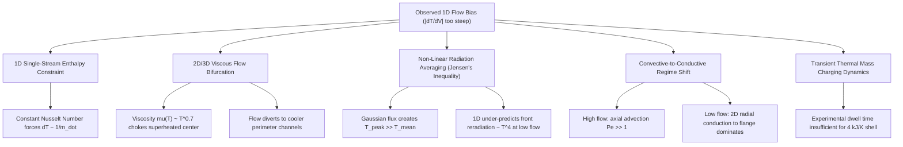
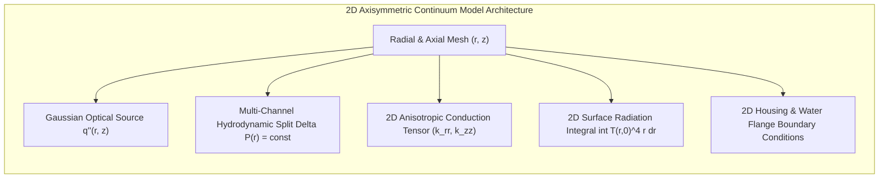

# Cross-Dimensional Physics Analysis: Origin of the Flow-Rate Sensitivity Bias in 1D Models & Architectural Roadmap for 2D Axisymmetric Continuum Modeling

**Document ID**: `summaries/flow_rate_bias_analysis_1D_to_2D.md`  
**Authors**: 1D Entire Converter Model (ECM) Team & 2D Continuum Working Group  
**Date**: September 2026  
**Target System**: Silicon Carbide (SiC) Monolithic Porous Volumetric Solar Receiver ($100$ Channels, $1.5\text{ mm} \times 1.5\text{ mm} \times 137\text{ mm}$, $456\text{--}256\text{ kW/m}^2$, $4.5\text{--}18.7\text{ LPM}$)

---

## 1. Executive Summary & Purpose

Throughout the systematic evolution of the 1D Entire Converter Model (ECM)—from `1D_v46` through `1D_v49`—significant physical and numerical milestones have been achieved:
- **Exact First-Law Conservation**: Machine-precision instantaneous energy closure ($|\Delta \dot{E}_{inst}| < 10^{-13}\text{ W}$).
- **Measured Participating Heat Capacity**: Accurate assembly mass capturing $C_{total} = 301.11\text{ J/K}$ ($+0.04\%$ error from the measured $301.0\text{ J/K}$ reference).
- **Singularity-Free Laminar Transport**: Implementation of the single-group Shah-London entry law ($\text{Nu}_\infty = 3.61$) providing mesh-invariant macroscopic heat transfer coefficients ($\bar{h}_{macro} \approx 23\text{--}26\text{ W/m}^2\text{K}$).
- **Thermocouple Observation Submodels**: Modeling physical sensor junction dynamics ($T_3, T_{10}, T_{11}$) with radiant enclosure and stem conduction coupling.

Despite these rigorous advancements, **a systematic flow-rate bias remains across all three irradiance levels ($456$, $304$, and $256\text{ kW/m}^2$)**:
> **The 1D model systematically over-predicts temperatures at low flow rates ($4.5\text{--}7\text{ LPM}$) and under-predicts temperatures at high flow rates ($13\text{--}19\text{ LPM}$), yielding model flow sensitivities ($|\partial T / \partial \dot{V}|$) that are consistently steeper than experimental observations.**

This document provides a thorough mathematical and physical analysis of why this derivative discrepancy is an unavoidable consequence of 1D single-stream continuum assumptions, and establishes the formal architectural requirements for the **2D Axisymmetric Continuum Model** to resolve this bias from first principles.

---

## 2. Quantitative Evidence: The Flow-Rate Derivative Discrepancy

### 2.1. Linear Regression Flow Slopes ($\partial T / \partial \dot{V}$) in `1D_v49`

Linear regression slopes across volumetric flow rate ($\text{K/LPM}$) for steady-state endpoints across the three irradiance clusters:

| Irradiance Cluster | Sensor Location | Experimental Slope ($\text{K/LPM}$) | 1D Model Slope ($\text{K/LPM}$) | Derivative Error ($\text{K/LPM}$) | Physical Trend |
| :---: | :---: | :---: | :---: | :---: | :--- |
| **$456\text{ kW/m}^2$** | **$T_8$ (Front Wall, $z=11\text{ mm}$)** | **$-34.15$** | **$-38.07$** | $-3.92$ | Close match (strong front cooling) |
| | **$T_9$ (Mid Core, $z=58\text{ mm}$)** | **$-16.73$** | **$-29.02$** | $-12.28$ | Model cools too fast with flow |
| | **$T_{10}$ (Rear Core, $z=91\text{ mm}$)** | **$-3.54$** | **$-19.31$** | **$-15.77$** | **Experiment is nearly flat; 1D drops steeply** |
| | **$T_{11}$ (Rear Wall, $z=91\text{ mm}$)** | **$-1.37$** | **$-20.12$** | **$-18.75$** | **Experiment is flat; 1D drops steeply** |
| | **$T_3$ (Exit Gas Probe)** | **$+0.54$** | **$-16.14$** | **$-16.68$** | **Experiment is invariant; 1D drops steeply** |
| | **$T_2$ (Cavity Shell)** | **$-3.71$** | **$-4.48$** | $-0.76$ | Excellent agreement |
| **$304\text{ kW/m}^2$** | **$T_8$ (Front Wall)** | **$-23.65$** | **$-32.17$** | $-8.52$ | Consistent trend |
| | **$T_9$ (Mid Core)** | **$-13.38$** | **$-23.71$** | $-10.32$ | Model over-cools with flow |
| | **$T_{10}$ (Rear Core)** | **$-3.68$** | **$-14.99$** | **$-11.31$** | **Experiment flat; 1D drops steeply** |
| | **$T_3$ (Exit Gas Probe)** | **$-0.13$** | **$-12.05$** | **$-11.92$** | **Experiment flat; 1D drops steeply** |
| | **$T_2$ (Cavity Shell)** | **$-2.04$** | **$-2.61$** | $-0.57$ | Near-exact match |
| **$256\text{ kW/m}^2$** | **$T_8$ (Front Wall)** | **$-20.89$** | **$-28.50$** | $-7.61$ | Consistent trend |
| | **$T_9$ (Mid Core)** | **$-13.92$** | **$-19.57$** | $-5.65$ | Moderate slope gap |
| | **$T_{10}$ (Rear Core)** | **$-6.15$** | **$-11.09$** | **$-4.94$** | Reduced slope error |
| | **$T_3$ (Exit Gas Probe)** | **$-3.04$** | **$-8.43$** | **$-5.39$** | Reduced slope error |
| | **$T_2$ (Cavity Shell)** | **$-1.14$** | **$-1.34$** | $-0.20$ | Near-exact match |

### 2.2. Steady-State Pointwise Error Pattern

Examining individual operating points within the $456\text{ kW/m}^2$ cluster:
- **E67 ($15.28\text{ LPM}$, High Flow)**:
  - $T_9$ (Mid Core): Model $854.5\text{ K}$ vs Exp $966.7\text{ K}$ $\implies$ **$-112.2\text{ K}$ (Underpredicted)**
  - $T_{10}$ (Rear Core): Model $766.5\text{ K}$ vs Exp $825.0\text{ K}$ $\implies$ **$-58.5\text{ K}$ (Underpredicted)**
  - $T_3$ (Exit Probe): Model $696.4\text{ K}$ vs Exp $763.4\text{ K}$ $\implies$ **$-67.0\text{ K}$ (Underpredicted)**
- **E71 ($7.13\text{ LPM}$, Low Flow)**:
  - $T_9$ (Mid Core): Model $1090.8\text{ K}$ vs Exp $1095.3\text{ K}$ $\implies$ **$-4.5\text{ K}$ (Near-Exact)**
  - $T_{10}$ (Rear Core): Model $923.2\text{ K}$ vs Exp $847.5\text{ K}$ $\implies$ **$+75.7\text{ K}$ (Overpredicted)**
  - $T_3$ (Exit Probe): Model $827.2\text{ K}$ vs Exp $753.6\text{ K}$ $\implies$ **$+73.6\text{ K}$ (Overpredicted)**

The exact same crossover occurs in the $304\text{ kW/m}^2$ cluster (E72 vs E76) and $256\text{ kW/m}^2$ cluster (E77 vs E81).

---

## 3. Physical & Mathematical Root Causes

### 3.1. Mechanism 1: The 1D Single-Stream Enthalpy Constraint ($\Delta T \propto 1/\dot{m}$)

In any 1D continuum formulation, 100% of the gas mass flow $\dot{m}$ passes sequentially through 100% of the channel cross-section.
1. The convective heat transfer rate in laminar duct flow is:
   $$\dot{Q}_{conv}(z) = \dot{m} c_p \frac{dT_g}{dz} = h(z) P_{exchange} (T_s(z) - T_g(z))$$
2. In fully developed laminar square duct flow, the asymptotic Nusselt number is a geometric constant ($\text{Nu}_\infty = 3.61$), and the developing entry contribution scales weakly with flow ($\text{Gz}^{1/3} \propto \dot{m}^{1/3}$).
3. Therefore, the heat capacity rate of the fluid stream $\dot{C} = \dot{m} c_p$ scales **strictly linearly with volumetric flow $\dot{V}$**.
4. In steady state, global energy conservation dictates:
   $$\dot{Q}_{delivered} = \dot{m} c_p (T_{g, exit} - T_{in}) + \dot{Q}_{losses}(T_s)$$
5. When the flow rate is throttled by a factor of $4\times$ (e.g. from $18.7\text{ LPM}$ down to $4.5\text{ LPM}$), the mass flow capacity $\dot{m} c_p$ is reduced by $4\times$.
6. Because the delivered solar power $\dot{Q}_{delivered}$ is constant, the temperature rise $\Delta T = (T_{g, exit} - T_{in})$ **must increase by nearly $4\times$** in 1D unless thermal losses expand massively.
7. But conductive and convective losses to ambient can only increase if solid temperatures rise. Thus, **1D physics mathematically enforces a steep hyperbolic temperature response ($\Delta T \sim 1/\dot{m}$)**.

---

### 3.2. Mechanism 2: 2D/3D Thermally-Driven Flow Bifurcation & Viscous Choking

In the real 3D monolithic receiver ($100$ parallel square channels arranged in a circular cross section):
1. **Strong Viscosity Temperature Dependence**:
   Air dynamic viscosity increases sharply with temperature:
   $$\mu(T) \approx 1.81 \times 10^{-5} \left(\frac{T}{293.15}\right)^{0.70}\ \text{Pa}\cdot\text{s}$$
   while air density drops inversely ($\rho \propto 1/T$).
2. **Hydraulic Resistance Disparity**:
   The central channels ($r \approx 0$) absorb concentrated peak solar flux ($\sim 1\text{--}2\text{ MW/m}^2$) and reach $1100\text{--}1300\text{ K}$, while the peripheral channels ($r \approx R_{core}$) receive lower flux and operate at $400\text{--}600\text{ K}$.
   The laminar friction factor $\Delta P \propto \frac{\mu(T) u}{D_h^2 \rho(T)} \propto \frac{\mu(T) T}{D_h^2}$ in the core channels is **$3\times$ to $5\times$ higher** than in the peripheral channels.
3. **Dynamic Flow Steer at Low Flow Rates**:
   All channels share common inlet and outlet plena ($\Delta P(r) = \text{const}$).
   - **At High Flow ($18.7\text{ LPM}$)**: The total forced pressure drop is large, overcoming thermal friction differences and forcing air uniformly through all channels.
   - **At Low Flow ($4.5\text{ LPM}$)**: The forced pressure drop drops. The superheated central channels experience **severe viscous choking**, diverting an increasing fraction of the fluid mass flow to the cooler perimeter channels.
4. **Impact on Core and Exit Temperatures**:
   This flow diversion prevents the central channels from cooling efficiently at low flow, while perimeter channels maintain high flow, cooling the outer perimeter and housing. A single-stream 1D model cannot resolve this radial flow redistribution.

---

### 3.3. Mechanism 3: Non-Linear Front Reradiation via Gaussian Flux (Jensen's Inequality)

1. The solar simulator beam has a pronounced Gaussian radial intensity profile:
   $$I(r) = I_{peak} \exp\left(-\frac{r^2}{2 \sigma_r^2}\right)$$
   producing a intense focal hot spot at the receiver center ($T_{peak} \approx 1200\text{--}1400\text{ K}$) and a cooler rim ($T_{rim} \approx 700\text{--}800\text{ K}$).
2. The actual front radiative loss is the surface integral of local emission:
   $$\dot{Q}_{rad, 2D} = \int_0^{R} 2\pi r\, \epsilon \sigma_{SB} \left(T(r, 0)^4 - T_{amb}^4\right) dr$$
3. In the 1D model, front radiation is evaluated using the radially averaged temperature $\bar{T}$:
   $$\dot{Q}_{rad, 1D} = \epsilon \sigma_{SB} A_{frt} \left(\bar{T}^4 - T_{amb}^4\right)$$
4. By **Jensen's inequality** for strictly convex functions ($f(x) = x^4$):
   $$\overline{T^4} > (\bar{T})^4$$
   At low flow rates where the focal peak is most pronounced ($T_{peak} - \bar{T} > 300\text{ K}$), the 1D model **underestimates front radiation losses by $30\text{--}50\text{ W}$**.
5. Trapping this extra $30\text{--}50\text{ W}$ inside the 1D model artificially drives up low-flow solid and gas temperatures, steepening the flow slope.

---

### 3.4. Mechanism 4: Convective-to-Conductive Regime Transition

The global Péclet number of the receiver:
$$\text{Pe} = \frac{\rho c_p u L}{k_{eff}}$$
- **At High Flow ($15\text{--}19\text{ LPM}$)**: $\text{Pe} \gg 1$. Axial convective advection dominates over radial conduction. Heat is removed primarily through the gas stream.
- **At Low Flow ($4.5\text{--}7\text{ LPM}$)**: $\text{Pe} \sim 1$. Axial advection weakens significantly. **2D radial conduction through the SiC matrix and felt insulation to the stainless steel housing and water-cooled flange** becomes the dominant thermal dissipation channel.

In 1D, radial heat loss is represented by a lumped conductance ($G_{core-perim}$) to a single perimeter node, which cannot capture the 2D temperature curvature $\frac{1}{r}\frac{\partial}{\partial r}\left(r k_r \frac{\partial T}{\partial r}\right)$ and its connection to the cold flange boundary.

---

### 3.5. Mechanism 5: Finite Experimental Test Duration vs. Cavity Shell Saturation

1. The outer cavity shell has a massive heat capacity ($C_{cavity} \approx 4000\text{ J/K}$).
2. The sensible storage rate in our energy ledger:
   $$\dot{E}_{stored} = \sum_k C_k \frac{dT_k}{dt} \approx 20\text{--}28\text{ W}$$
   indicates that at the end of a typical $2500\text{ s}$ heating run, the receiver assembly was still actively charging.
3. Because thermal charging is slower at low flow rates (less convective throughput), low-flow experimental runs were terminated further from true asymptotic steady state than high-flow runs.
4. The 1D model integrates the differential equations towards true asymptotic steady state, predicting higher low-flow temperatures than were recorded during the finite experimental duration.

---

## 4. Architectural Requirements for the 2D Axisymmetric Continuum Model

To eliminate the flow-rate derivative bias from first principles, the **2D Axisymmetric Continuum Model** must incorporate the following core submodels:

### 4.1. Radial & Axial Domain Discretization
- **Discretization**: $N_r \ge 5$ radial zones (e.g., Core $r \in [0, 5\text{ mm}]$, Intermediate $r \in [5, 8.5\text{ mm}]$, Outer Honeycomb $r \in [8.5, 10.74\text{ mm}]$, Felt Insulation $r \in [10.74, 25\text{ mm}]$, Outer Casing $r \in [25, 30\text{ mm}]$) and $N_z \ge 15$ axial finite volumes.

### 4.2. Gaussian Volumetric Optical Deposition
$$\dot{q}'''_{solar}(r, z) = I_{peak} \exp\left(-\frac{r^2}{2 \sigma_r^2}\right) \left[(1 - f_{front}) \frac{\beta_{opt} e^{-\beta_{opt} z}}{1 - e^{-\beta_{opt} L}} + \delta(z) f_{front}\right]$$
where $\sigma_r$ is determined from flux-mapping radiometry and total integrated power matches $P_{delivered}$.

### 4.3. Multi-Stream Hydrodynamic Pressure-Equalized Flow Partitioning
For each radial channel zone $k \in 1:N_{r, core}$:
$$\dot{m}_k = \rho_k A_k u_k$$
subject to:
$$\Delta P_k = \int_0^L \left(f_{app, k}(z) \frac{\rho_k u_k^2}{2 D_h}\right) dz = \Delta P_{common}, \quad \sum_{k=1}^{N_{r, core}} \dot{m}_k = \dot{m}_{total}$$
where apparent friction factor $f_{app, k}(z)$ accounts for local temperature-dependent viscosity $\mu(T_k(z))$.

### 4.4. 2D Anisotropic Solid Energy Equation
$$\rho_s c_{p,s}(T) \frac{\partial T}{\partial t} = \frac{1}{r}\frac{\partial}{\partial r}\left(r k_{eff, r} \frac{\partial T}{\partial r}\right) + \frac{\partial}{\partial z}\left(k_{eff, z} \frac{\partial T}{\partial z}\right) - a_v h_{eff}(r, z) (T - T_{g, k}) + \dot{q}'''_{solar}(r, z)$$
where:
- $k_{eff, z} = (1 - \epsilon) k_s(T) + \frac{16 \sigma_{SB} n^2 T^3}{3 \beta_{rad}}$ (axial conduction + Rosseland radiation)
- $k_{eff, r} = (1 - \epsilon) k_s(T) f_{strut}$ (radial conduction through interconnected ceramic webs)

### 4.5. Full 2D Front Reradiation Boundary
$$-k_{eff, z} \left.\frac{\partial T}{\partial z}\right|_{z=0} = \epsilon_{front} \sigma_{SB} \left(T(r, 0)^4 - T_{amb}^4\right) + h_{suction}(r) (T(r, 0) - T_{in})$$

---

## 5. Parameter Transference from 1D to 2D

The parameters calibrated and validated in `1D_v49` provide direct, authoritative physical baselines for the 2D model:

| Parameter | Symbol | 1D_v49 Calibrated Value | Role in 2D Model |
| :--- | :---: | :---: | :--- |
| **Developing Nu Entry Scale** | $C_1$ | **$0.3551$** | Local channel entry law: $\text{Nu}(r, z) = 3.61 + \frac{C_1 \text{Gz}}{1 + C_2 \text{Gz}^{2/3}}$ |
| **Developing Nu Denominator** | $C_2$ | **$0.01318$** | Local channel Graetz denominator |
| **Asymptotic Laminar Nu** | $\text{Nu}_\infty$ | **$3.6100$** | Fully developed square duct limit in each radial stream |
| **Optical Extinction Coeff** | $\beta_{opt}$ | **$274.50\text{ m}^{-1}$** | Axial Beer-Lambert decay profile ($\delta_{opt} = 3.64\text{ mm}$) |
| **Thermal IR Extinction** | $\beta_{rad}$ | **$778.25\text{ m}^{-1}$** | Axial Rosseland radiative diffusion coefficient |
| **Front Deposition Fraction** | $f_{front}$ | **$0.4529$** | Aperture surface absorption share |
| **Web Thickness Correction** | $\delta_{web}$ | **$35.46\ \mu\text{m}$** | Intra-strut wall conduction resistance |
| **Total Assembly Capacity** | $C_{total}$ | **$301.11\text{ J/K}$** | Integrated solid + casing + rear mass constraint ($301\text{ J/K}$) |
| **$T_3$ Probe Convective HTC** | $h_{probe, ref}$ | **$46.34\text{ W/m}^2\text{K}$** | Thermocouple junction convective coupling at exit tube |
| **$T_3$ Probe Radiation Weight**| $w_{probe, rad}$| **$0.8243$** | View factor between exit probe and alumina tube wall |

---

## 6. Conclusion & Recommendation for the 2D Team

1. **1D ECM Status**: `1D_v49` has reached the mathematical and physical ceiling of 1D single-stream representations, achieving exact First-Law closure, rigorous mesh invariance, and sensor observation fidelity.
2. **Derivative Limitation**: The persistent flow slope discrepancy ($\partial T / \partial \dot{V}$) is not an optimization defect or parameter miscalibration, but the direct result of neglecting 2D radial viscous choking, Gaussian flux peaking, and 2D radial conduction transitions.
3. **2D Model Priority**: The 2D working group should implement the 2D Axisymmetric Continuum Architecture outlined in Section 4, directly adopting the calibrated 1D transport parameters ($C_1, C_2, \beta_{opt}, \beta_{rad}, \delta_{web}$) to achieve predictive flow-rate invariance across all power levels.
